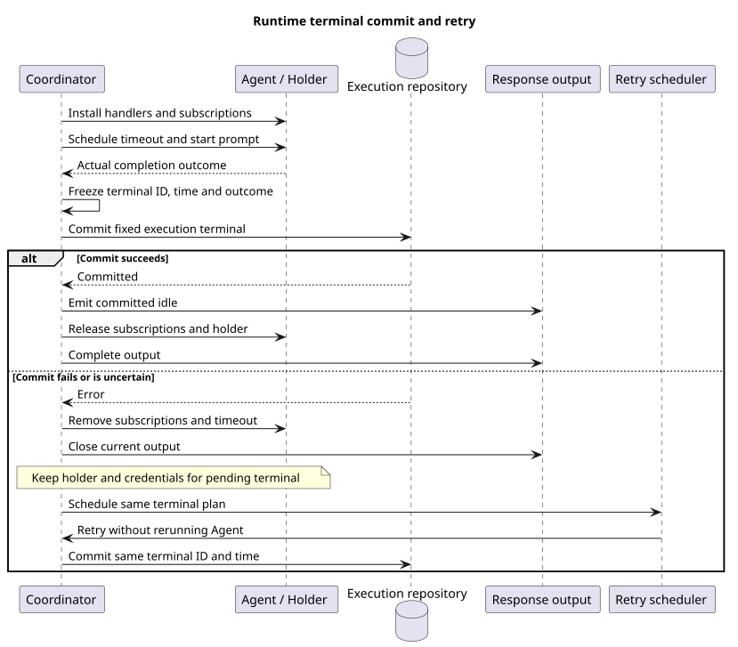

# Events 执行终态与资源释放

> 版本：1.0.0 · 日期：2026-09-08 · 状态：协调组件已实现，HTTP 独立接入

## Context 与源码证据

已接纳执行的模型结束与数据库提交可能分别失败。协调器按真实运行结果提交终态，提交未确认时保留执行对象，
避免丢失结果或提前释放凭据。这是首次发布的运行时故障恢复，不涉及数据库升级或历史迁移。

实现提交 `ba9e497c`，轮询配置合并 `5c74e897`，格式整理 `04744002`；主线 `48aac44a` 已包含执行支持和轮询。
设计仓基线 `2ee2a3211da68ad87b0d9cab353e691b00bdaebd` 的
`01-总体架构/01-CampusClaw多Agent运行时/chat-events-v2-design.md` 定义公共终态与固定执行目标。

| 实现仓相对路径与符号 | 观察、决定和理由 |
|---|---|
| `modules/coding-agent-cli/src/main/java/com/campusclaw/codingagent/runtimeapi/event/RuntimeV2ExecutionCoordinator.java#start/#subscribe` | 安装可信确认处理器、订阅 Agent 和压缩通知、安排超时，再开始 prompt；失败释放已登记资源。 |
| 同类 `#terminalOutcome/#executionPlan` | 实际 STOP/ERROR/ABORTED 对应 done/failed/terminated；接纳中断不覆盖自然完成或失败。 |
| 同类 `#terminalPlan/#commitTerminal/#commitAndRelease` | 一次确定终态 ID、时间和结果，以固定执行目标提交内部 idle、公共 idle 和状态，成功后释放 Holder。 |
| 同类 `#deferTerminal/#suspendForRetry/#retryTerminal` | 提交失败时解除监听和硬超时、关闭当前输出，保留执行对象和计划；只重试该终态写入。 |
| `modules/coding-agent-cli/src/main/java/com/campusclaw/codingagent/runtimeapi/runtime/RuntimeTerminalRetryScheduler.java` | 独立单线程延迟重试，不阻塞超时调度；停止应用时取消未触发任务。 |
| `modules/coding-agent-cli/src/main/java/com/campusclaw/codingagent/runtimeapi/runtime/RuntimeExecutionProperties.java` | terminal-retry-interval 默认 1 秒；与 max-duration、control-poll-failure-backoff 一起要求为正。 |
| `modules/coding-agent-cli/src/main/java/com/campusclaw/codingagent/runtimeapi/event/RuntimeV2EventProjectorFactory.java#create` | 使用当前执行目标、共享仓储、公开帧体积限制和本次 thinking 配置创建转换器。 |

pi 基线 `4af9d21d3b4d664e4a29fcabfec85171077248e3` 的 `packages/agent/src/agent-loop.ts#runLoop`
负责 Agent 循环，不提供本项目的数据库终态事务和 HTTP 响应段；上述协调属于 Java 架构变化。

## 数据流与边界

[PlantUML 源码](diagram.puml#L1)

硬超时先请求 Agent 中止，再释放待确认工具；终态仍使用实际结束证据。
提交未确认期间继续占用执行容量并保留原凭据；成功提交或进程退出才结束持有。
终态重试复用同一 ID 和时间，不重放已接纳消息；既有仓储负责幂等与持久状态完整性。
进程重启仍走既有恢复路径，不重新运行未完成模型执行。

本片不接纳 HTTP 请求；统一服务接入时删除尚有主线消费者的旧协调链。
这些中间开发状态不构成已发布的兼容契约。

## 性能、验证与决定

每个待重试执行最多安排一个后续任务，数量受活动执行容量限制；持续数据库故障会继续占用容量。
新增一个进程内调度线程，不新增依赖、表、外部队列或升级脚本。

root 协调器 11 项和控制轮询 7 项，共 18 项测试通过，零失败、零跳过。
覆盖自然完成/中断竞态、启动失败、监听清理、超时确认顺序、同一终态重试后释放资源。
轮询配置合并产生的 Spotless 格式问题在 `04744002` 修正，随后 Spotless/Checkstyle 复验通过。
测试使用固定 Clock、可控 Future 和手动触发任务；仓储事务由相应数据库测试承担。
application.yml 按仓库约定只保留 canonical 配置，其余源码同步生成镜像。
公司 NativeParent 26.0.0-SNAPSHOT 本机不可解析，企业 Maven 编译未验证。

[ADR-0094](../../decisions/0094-coordinate-runtime-terminal-commit.html)

| 版本 | 日期 | 说明 |
|---|---|---|
| 1.0.0 | 2026-09-08 | 记录实际终态、资源生命周期和固定计划重试。 |
