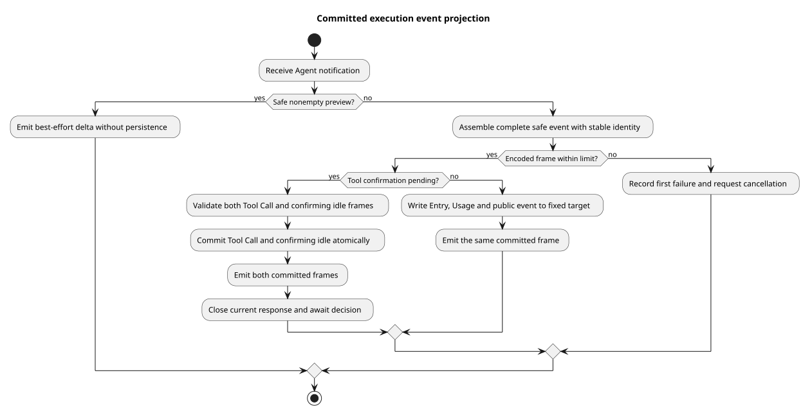

# Events v2 执行事件转换

> 版本：1.0.0 · 日期：2026-09-08 · 状态：转换器已实现，协调器与 HTTP 独立接入

## Context 与证据

Agent 的过程通知包含预览、内部消息和工具事件，不能直接当作公开历史。
本片把完成事件写入固定执行段，再发送相同结构的 SSE；预览不入库。
实现为 `bc8298fd`，其两份源码与最终集成 `da092cd1` 一致；前置代码基线 `40974151`
包含已确认的执行对象与权限支持，主线基础为 `2bdcdcb2`。
规范来自设计仓 `2ee2a3211da68ad87b0d9cab353e691b00bdaebd` 的
`01-总体架构/01-CampusClaw多Agent运行时/chat-events-v2-design.md`。

| 实现仓相对路径与符号 | 观察、决定和理由 |
|---|---|
| `modules/coding-agent-cli/src/main/java/com/campusclaw/codingagent/runtimeapi/event/RuntimeV2EventProjector.java#persistAssistant/#persistThinking` | 完整事件先检查编码体积，再以固定执行目标组合写内部 Entry、Usage 和公共事件；发送使用同一个已组装帧。 |
| 同类 `#emitMessageDelta/#projectThinking` | 忽略空 delta，仅公开 Provider 明确标记的 summary；预览没有持久时间和 Usage，私人推理不进入公共流。 |
| 同类 `#persistFinalizedToolCalls/#persistMissingToolCall` | 工具校验失败或权限拒绝也必须先有完整 tool_call；同一 Tool Call 不因后续执行通知重复写入。 |
| 同类 `#beginConfirmation/#persistConfirming` | 核对模型已完成的 Tool Call，原子提交 tool_call 和 confirming idle 后关闭本段响应，等待可信决定；续跑仍使用同一根事件。 |
| 同类 `#projectCompaction/#discardedEntryId` | 自动压缩保留精确 Entry 边界、重试候选身份及 Usage，公开事件仅含安全统计；无有效保留边界时拒绝。 |
| 同类 `#requireCommittedFrame/#recordFailure` | 每个完整帧在入库前受本征体积限制；只记录首个失败并发出一次取消请求，不把失败后的输出继续写入。 |
| `modules/coding-agent-cli/src/test/java/com/campusclaw/codingagent/runtimeapi/event/RuntimeV2EventProjectorTest.java` | 使用真实编码器和转换器，替换持久化边界；验证输出形状、写入目标、权限确认段与失败顺序。 |

pi 基线 `4af9d21d3b4d664e4a29fcabfec85171077248e3` 的
`packages/agent/src/agent-loop.ts#runLoop/#prepareToolCall` 提供消息、工具和取消通知，
没有公共事件库和结果段。持久化分段是 Java 架构变化；仅公开安全 summary 和限制完整帧大小属于安全约束。

## 流程与边界

[PlantUML 源码](diagram.puml#L1)

delta 只通过 best-effort 输出发送；完整事件必须先确定 ID、毫秒时间和安全载荷。
固定目标中的段可以因已接纳确认而变化，根事件保持不变。确认输出失败只影响连接，已提交确认状态仍由数据库保留。
跨实例续跑没有本地响应时仍执行相同编码体积检查和持久化，不能绕过输出大小限制。

AgentEnd 的取消标志补充实际退出证据；false 不代表成功，仍保留 Assistant 的 STOP、ERROR、ABORTED。
转换器拒绝新的排队 UserMessage；HTTP 中断和确认由独立服务接纳，不作为排队文本执行。
本片没有 Controller 接线，也不负责接纳收据、最终 idle 提交或释放执行凭据；这些属于协调器和服务。

## 性能、验证与决策

转换按事件处理，保存当前 Assistant 和工具身份映射；压缩时按 500 条批量读取当前分支。
不新增线程、数据库对象、依赖或升级流程。单次完整事件体积受配置上限限制，预览队列容量由输出实现控制。

root 聚焦测试 10 项通过，零失败、零跳过；覆盖完整帧、空预览、私人推理过滤、无 start 的失败工具、
确认续跑、自动压缩、数据库失败一次取消和本地/远端完整事件超限。Spotless、Checkstyle 通过。
两组公司镜像与源码一致；企业 NativeParent 26.0.0-SNAPSHOT 本机不可解析，企业 Maven 编译未验证。
真实数据库事务和 HTTP 行为由组合写入及后续接入测试覆盖，本片的 mock 仓储测试不替代它们。

[ADR-0093](../../decisions/0093-project-committed-execution-events.html)

| 版本 | 日期 | 说明 |
|---|---|---|
| 1.0.0 | 2026-09-08 | 记录固定目标事件转换、确认段、安全投影和失败边界。 |
