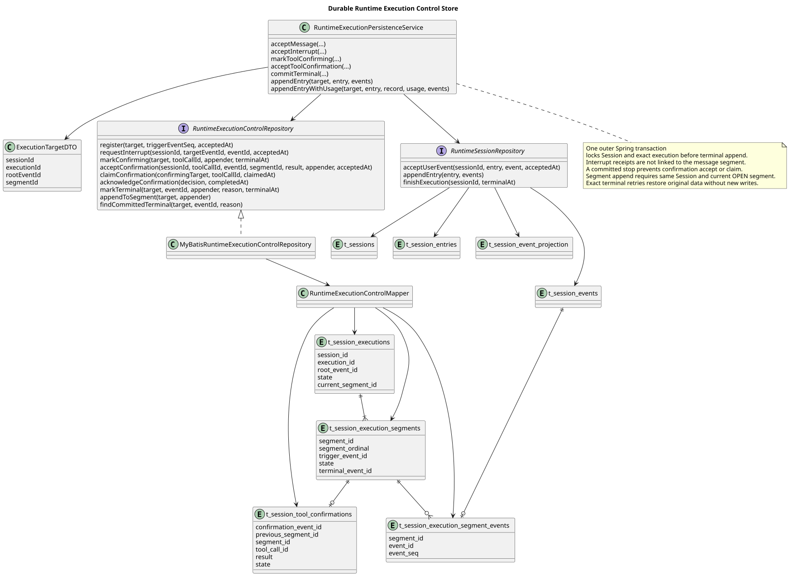

# 固定执行控制与应用事务

| 属性 | 值 |
|---|---|
| 版本 | 0.3.0 |
| 日期 | 2026-09-08 |
| 设计契约 | `pi-mono-java-design@2ee2a3211da68ad87b0d9cab353e691b00bdaebd` |
| 变更前 Java 源码基线 | `pi-mono-java@fd556dce3cfa12e5e834b6e9b8f835f10e7d67c8` |
| 存储实现提交 | `8ec383dd0ee6a5a8fe7e72b9e97bba8f71c8f8da`；主线集成 `4c580a7a`，权限补齐 `dae01509` |
| 应用事务实现提交 | `92562f62`～`8e775f1c`；本分支主线合并 `30ae1952` |
| 终态恢复与段内追加实现 | `9ad3553a`～`2ef30225`，基于 `3cf28323` |
| pi 源码基线 | `pi@4af9d21d3b4d664e4a29fcabfec85171077248e3` |
| 范围 | 固定执行存储，以及消息、中断、进入确认和真实终态的应用事务；不包含 Events v2 HTTP 路由和跨实例轮询 |

## Context

设计仓的 `chat-events-v2-design.md` §4.4～§4.5 要求在执行开始前固定内部执行身份，
把原 `user.message.eventId` 作为根事件，并为初始响应和每次确认续跑建立不同结果段。
这样迟到的中断不能只凭 Session 当前状态误停下一轮，确认续跑也不会把新输出写回已经关闭的响应。

变更前 Java 仅在 `RuntimeActiveExecution.runId` 保存进程内标识；另一个服务实例不能据此绑定控制目标。
0.1 版增加低层持久化边界。0.2 版在 Spring 外层事务中组合 Session Entry、公共完整事件、
执行身份和结果段关联，使消息受理、中断受理、进入确认和真实终态具有一个提交点。

## 源码证据与设计理由

| 分类 | 路径与符号 | 观察与理由 |
|---|---|---|
| 变更前 Java | `modules/coding-agent-cli/src/main/java/com/campusclaw/codingagent/runtimeapi/runtime/RuntimeActiveExecution.java#beginRun/runId` | 标识随 JVM 内对象存在，不能用于跨实例事务校验 |
| 变更前 Java | `modules/coding-agent-cli/src/main/java/com/campusclaw/codingagent/runtimeapi/persistence/MyBatisRuntimeSessionRepository.java#acceptUserEvent/finishExecution` | Session 已有 idle/running 准入事务，但没有根执行、结果段和控制事件关联 |
| 本片实现 | `modules/coding-agent-cli/src/main/java/com/campusclaw/codingagent/runtimeapi/persistence/RuntimeExecutionControlRepository.java` | 定义登记、精确读取、完整事件关联、confirming 关段和真实终态 CAS |
| 本片实现 | `modules/coding-agent-cli/src/main/java/com/campusclaw/codingagent/runtimeapi/persistence/MyBatisRuntimeExecutionControlRepository.java` | 统一先锁 Session，再锁固定执行；拒绝过期 segment 和重复终态 |
| 本片实现 | `modules/coding-agent-cli/src/main/resources/db/gaussdb/install/session_schema.sql` | 三张 `t_` 表保存根执行、结果段和段内完整事件顺序；toolCallId 使用 TEXT |
| 本片实现 | `modules/coding-agent-cli/src/main/java/com/campusclaw/codingagent/runtimeapi/persistence/MyBatisRuntimeSessionRepository.java#completeCleanup` | Session 清理先删除段事件、段和根执行，避免控制数据永久残留 |
| 0.2 应用事务 | `modules/coding-agent-cli/src/main/java/com/campusclaw/codingagent/runtimeapi/persistence/RuntimeExecutionPersistenceService.java#acceptMessage/acceptInterrupt/markToolConfirming/commitTerminal` | 用外层 Spring 事务组合 Session、Entry、公共事件和固定执行状态 |
| 0.2 锁内回调 | `modules/coding-agent-cli/src/main/java/com/campusclaw/codingagent/runtimeapi/persistence/RuntimeExecutionControlRepository.java#ConfirmingAppender/TerminalAppender` | 在写权威事件前先锁定并复核精确目标，过期目标不会调用写入回调 |

pi `packages/agent/src/agent-loop.ts#runAgentLoop` 使用调用方提供的 `AbortSignal` 驱动一轮循环，
`prepareToolCall` 在工具执行前再次检查该信号。pi 没有 CampusClaw 的共享数据库、HTTP Session 资源或
跨实例路由。本片的固定数据库身份属于 CampusClaw 架构变化，不把它描述为 pi 已有能力。

## 架构与数据流

[PlantUML 源码](diagram.puml#L1)

`t_session_executions` 为一个根消息保存不可复用的 `execution_id`、公开 `root_event_id`、当前
`segment_id` 和控制状态。同一 Session 只允许一条非 TERMINAL 执行。
`t_session_execution_segments` 按序保存初始段和确认续跑段；关闭段时固定唯一 idle 事件及原因。
`t_session_execution_segment_events` 只关联实际属于该 HTTP 结果段的完整事件，后续中断回执不会
因此自动进入原消息段。

## 事务与锁顺序

`RuntimeExecutionPersistenceService` 是应用事务边界。底层 Repository 使用 Spring `REQUIRED` 传播。
消息准入持有 Session 行锁，先分配统一序号并写 Entry、公共事件和完整性标记，再创建新的执行身份与结果段；
中断、进入确认和真实终态先锁已有 Session 和固定执行并校验当前结果段身份，再分配统一序号并写完整事件，
最后写段关联。任一步失败都会回滚同一事务内已写的数据与统一序号。

- `acceptMessage` 先通过 Session 准入事务写 `user.message` Entry 与公共事件，再登记根执行和初始段，
  最后把该回执关联到初始段。公开 `eventId` 同时成为不可变 `rootEventId`。
- `acceptInterrupt` 先锁 Session 和当前执行，校验必填 `targetEventId` 与根事件完全一致，并把执行改为
  STOPPING；随后写 `user.interrupt` Entry 与公共事件。该受理回执不关联到原消息结果段；中断 HTTP
  响应继续等待同一实际终态的能力尚未接入。
- `markToolConfirming` 在锁内确认执行仍为 RUNNING，再由回调依次写 `agent.tool_call` 和
  `session.status_idle` 完整事件、关联当前段并以 CONFIRMING 关闭该段；根执行进入 CONFIRMING，
  Session 保持 running。
- `commitTerminal` 在调用回调前锁定并复核完整 target；回调写唯一 `session.status_idle` Entry 与公共事件，
  然后关联段、关闭尚未关闭的当前段、终结根执行并把同一轮 Session 置为 idle。过期 target 不会触发回调。

`markTerminal` 同时校验 executionId、rootEventId 和当前 segmentId，只允许 done、failed、terminated
三个真实结束原因。状态与原因使用 typed enum；数据库保存既定大小写字面值。`compact` 保持自己的
Session 生命周期，本片不把任意 running Session 推断为用户消息执行。

## 边界与后续

0.3 版增加两个已实现的持久化边界：

- `RuntimeExecutionControlRepository.java#appendToSegment` 在 Session、执行和结果段行锁下核验完整
  target，仅允许 RUNNING/STOPPING 的当前 OPEN 段追加。`RuntimeExecutionPersistenceService.java`
  的两个追加重载先检查 Entry、公共事件及 Usage Record 属于同一 Session，再原子写入 Entry、可选用量、
  公共事件、精确标记和段关联。关联失败会回滚整个追加和序号；已关闭段或过期 target 不调用写入回调。
- `MyBatisRuntimeExecutionControlRepository.java#findCommittedTerminal` 按固定执行、根事件、段关联和
  终态 eventId/reason 恢复 `CommittedTerminalDTO`。同一终态重试返回原 Entry 与公共事件的 ID、序号、
  时间和正文，不再调用追加回调或改写 Session。已 closed 的 confirming 段保留其第一个 idle；之后的真实
  终态从 execution 的终态身份和段事件关联读取。即使后续新执行已使 Session running，恢复旧终态也不会
  把新执行置为 idle。不同终态 ID、原因或执行身份仍被拒绝。

上述三个 Java 文件均位于 `modules/coding-agent-cli/src/main/java/com/campusclaw/codingagent/runtimeapi/persistence/`；
快照 DTO 位于同级 `dto/CommittedTerminalDTO.java`，查询位于
`modules/coding-agent-cli/src/main/resources/mapper/session/RuntimeExecutionControlMapper.xml`。

本片没有把 Events v2 HTTP 联合输入切换到这些应用事务，也没有实现工具确认决定受理与一次消费、
执行协调器的后台终态重试调度、本地提交后唤醒、批量控制检查、
有界等待登记或结果补读，也没有退役旧控制接口。这些能力必须在后续切片单独验收。原执行凭据不会
写入控制表，进入 confirming 后由原实例继续持有。

没有新增 Maven 依赖。SQL 只进入首次发布的全量安装脚本；表名为小写蛇形 `t_` 前缀，所有
`COMMENT ON` 描述使用中文。`pending_tool_call_id` 使用 TEXT，不对提供商 Tool Call ID 增加未确认上限。
全量安装后通过 `modules/coding-agent-cli/src/main/resources/db/gaussdb/install/session_privileges.sql`
给运行角色授予新增控制表和公共事件表的 SELECT/INSERT/UPDATE/DELETE；表所有者权限不能代替部署角色授权。

## 验证

2026-09-08 在 Docker amd64 仿真的 openGauss 7.0.0-RC3 build01b7e318 上验证：

- 固定根执行与初始段能登记和读取，300 字符 Tool Call ID 可进入 confirming；Session 仍保持 running。
- 过期 segment 和重复终态不能覆盖已提交终态。
- 删除完成的 Session 后，段事件、段和根执行三张控制表全部清空，tombstone 继续保留。
- 应用事务独立审查执行 `RuntimeSessionRepositoryOpenGaussIT` 33 项与原子公共事件 2 项，共 35 项通过，
  无失败、错误或跳过；日志为 `/tmp/pi-events-v2-review/event-transactions/tests.log`。
- 回归覆盖消息准入整体回滚、中断目标校验和回滚、confirming 两个完整事件与段关闭、过期终态回调零调用、
  终态段关联失败时 Entry、公共事件、完整性标记、执行状态、Session 状态和统一序号整体回滚。
- 0.3 版在另一隔离数据库独立执行 Repository 39 项与公共事件 2 项，共 41 项通过，零跳过；新增回归覆盖
  跨 Session 的 Entry/事件/Usage Record 拒绝、过期段零回调、段关联冲突整体回滚、STOPPING 状态的实际输出、
  confirming 后中断终态恢复，以及旧终态重试不结束下一轮执行。
- 新建非所有者角色先实际重现读取控制表权限不足，再执行权限模板；该角色对三张控制表及公共事件表的 SELECT 和零行 INSERT/UPDATE/DELETE 全部成功。该检查验证权限，事务行为由上述数据库回归验证。
- `spotless:apply`、`checkstyle:check`、`test-compile`、聚焦真实数据库测试和 `git diff --check` 通过。

企业镜像通过生成同步检查；本地无法解析企业 `NativeParent:26.0.0-SNAPSHOT`，企业镜像编译尚未验证。

该数据库环境证明 SQL、MyBatis 映射和事务行为可运行，不构成企业生产性能或延迟承诺。

## 设计决策

见 [ADR-0075](../../decisions/0075-persist-runtime-execution-control.html)。

## 版本历史

| 版本 | 日期 | 变更 |
|---|---|---|
| 0.1.0 | 2026-09-08 | 增加固定根执行、结果段、段内事件关联、typed 状态和 Session 清理边界 |
| 0.1.1 | 2026-09-08 | 合并公共事件清理边界，补齐部署运行角色授权并增加非所有者权限验证 |
| 0.2.0 | 2026-09-08 | 增加消息、中断、进入确认与真实终态的外层原子事务和真实数据库回归 |
| 0.3.0 | 2026-09-08 | 增加固定段原子追加、终态幂等恢复和跨 Session 归属校验 |
