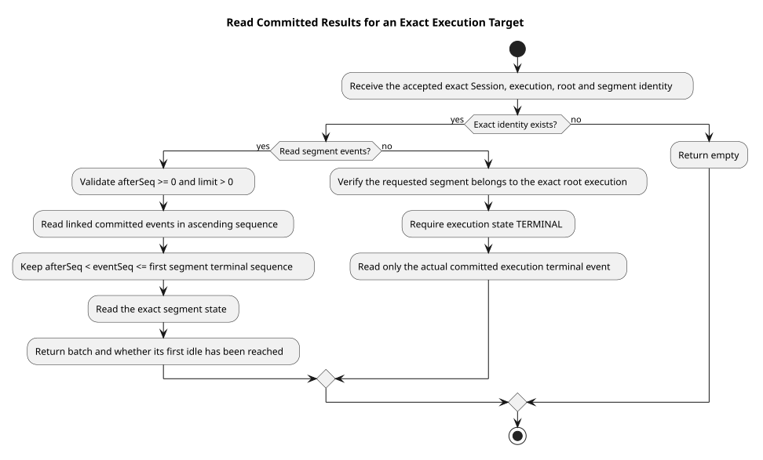

# 按固定执行身份补读结果

| 属性 | 值 |
|---|---|
| 版本 | 0.1.0 |
| 日期 | 2026-09-08 |
| 契约基线 | `pi-mono-java-design@2ee2a3211da68ad87b0d9cab353e691b00bdaebd` |
| Java 基线 | `pi-mono-java@201d75ed`；主线整合 `223e36e9`（包含 `80ca6cc9`） |
| 实现来源 | `0aa0cf8f`；首个 idle 上界修复 `1e9ab28c` |
| pi 基线 | `pi-mono@4af9d21d3b4d664e4a29fcabfec85171077248e3` |
| 范围 | 只读 Repository 与 Mapper；HTTP 接受、响应等待和本地通知由后续集成提供 |

## Context

确认请求可能由另一服务实例接受。原执行实例仍持有 Agent 和凭据，接受请求的实例只能读取已经提交的公共结果。
只按 Session 当前状态查询会误跟随后来的执行；把执行的最终结束等同于每条响应结束，又会跨过工具确认时的首个 idle。
因此需要固定执行身份，并区分结果段结束和根执行结束。

## 源码证据与理由

| 分类 | 仓库相对路径与符号 | 观察与理由 |
|---|---|---|
| 契约 | `01-总体架构/01-CampusClaw多Agent运行时/chat-events-v2-design.md` §4.4～§4.5 | 控制请求绑定不可复用执行身份；确认续跑使用新结果段 |
| 已实现 | `modules/coding-agent-cli/src/main/java/com/campusclaw/codingagent/runtimeapi/persistence/MyBatisRuntimeExecutionResultRepository.java` · `readSegmentEvents` | 返回固定段在游标之后的一批完整事件，并判断该段首个 idle 是否已到达 |
| 已实现 | `modules/coding-agent-cli/src/main/resources/mapper/session/RuntimeExecutionResultMapper.xml` · `listSegmentEvents` | 同时校验 Session、execution、root、segment，按统一序号读取且不超过该段固定 terminal_event_seq |
| 已实现 | `modules/coding-agent-cli/src/main/resources/mapper/session/RuntimeExecutionResultMapper.xml` · `findExecutionTerminal` | 要求原 segment 属于同一根执行，只返回 execution.state=TERMINAL 指向的真实结束事件 |
| 已实现 | `modules/coding-agent-cli/src/main/java/com/campusclaw/codingagent/runtimeapi/dto/SegmentEventBatchDTO.java` | 内部批次 DTO 包含完整事件列表和段结束标记，不作为 HTTP 响应 |
| pi 观察 | `packages/agent/src/agent-loop.ts` · `runAgentLoop` / `prepareToolCall` | pi 用本地事件与 AbortSignal 控制循环，没有 CampusClaw 共享数据库结果段 |

固定段及跨实例公共结果读取属于 CampusClaw 架构变化；数据库身份校验和仅返回已提交公共事件属于安全边界。

## 关键定义与读取流程

- 固定目标为 `ExecutionTargetDTO(sessionId, executionId, rootEventId, segmentId)`，来自已经接受的事务结果。
- `afterSeq` 是内部已投递游标，允许零；`limit` 必须为正数。它们不新增公开 HTTP 游标。
- 段结束使用 `t_session_execution_segments.terminal_event_seq`，包括 reason=confirming 的首个 idle。
- 根执行结束使用 `t_session_executions.terminal_event_id`，只代表 done、failed、terminated。

[PlantUML 源码](diagram.puml#L1)

段读取先查询完整事件，再读取段状态。事件始终按 event_seq 升序且受首个 idle 上界限制。
如果终态恰好在两次读取之间提交，本批可能还未含 idle，此时 terminal=false，调用方下一批继续读取。
只有本批最后序号或原游标已经到达该段的终态序号，才返回 terminal=true。不会仅凭 Session 已 idle 提前关流。

一段可能先进入 confirming，随后根执行被中断，实际 terminated 仍关联到该段。段读取必须停在 confirming；
中断响应的根执行读取则必须得到后来的 terminated。两种读取共享固定身份，使用不同终点。
错误 root 或不属于该执行的 segment 返回空；调用方不能改用“当前执行”兜底。

## 设计决策

见 [ADR-0083](../../decisions/0083-read-fixed-execution-results.html)。选择两个明确的只读接口，分别表达段结果和根执行终态。
按 Session 当前状态查询无法隔离后续执行；直接返回整段关联表又可能越过确认时的首个 idle，因此不采用。

## 事务、资源与边界

查询使用只读 Spring 事务和参数化 MyBatis SQL，没有行锁、外部调用或写入。
段事件查询使用现有 `(session_id, execution_id, segment_id, event_seq)` 索引和 limit；真实终态按根执行定位后，
通过 `(session_id,event_id)` 主键读取关联和公共事件。不引入新索引或 Maven 依赖。

这里只校验内部读取范围；后续响应等待层负责实际响应数量、批量目标、正向游标推进、查询超时、失败退避和连接释放。
本片不创建轮询线程，不发送 SSE，不证明另一个实例或工具已停止，也不改变 Holder 与凭据生命周期。
已提交公共事件仍须经过统一投影器编码；Repository 测试只验证读取身份、顺序和终点，不能替代 HTTP 契约联调。

## 验证

2026-09-08 在独立 Docker openGauss 7.0.0-RC3 数据库执行 Repository 42 项与公共事件原子事务 2 项，
共 44 项通过，零失败、错误或跳过。覆盖分页到首个 idle、到达终点后的空终态批次、错误 root/segment、
同段先 confirming 后 terminated 时两种读取终点不同。

Java/XML 规范、格式和编译、生成镜像、PlantUML ASCII 与生成同步、SVG XML、文档链接/锚点及 diff-check
均通过。企业镜像生成同步；本机无法解析 NativeParent 26.0.0-SNAPSHOT，企业 Maven 编译未验证。

## 版本历史

| 版本 | 日期 | 变更 |
|---|---|---|
| 0.1.0 | 2026-09-08 | 区分固定结果段首个 idle 与根执行真实终态，提供只读补读接口 |
