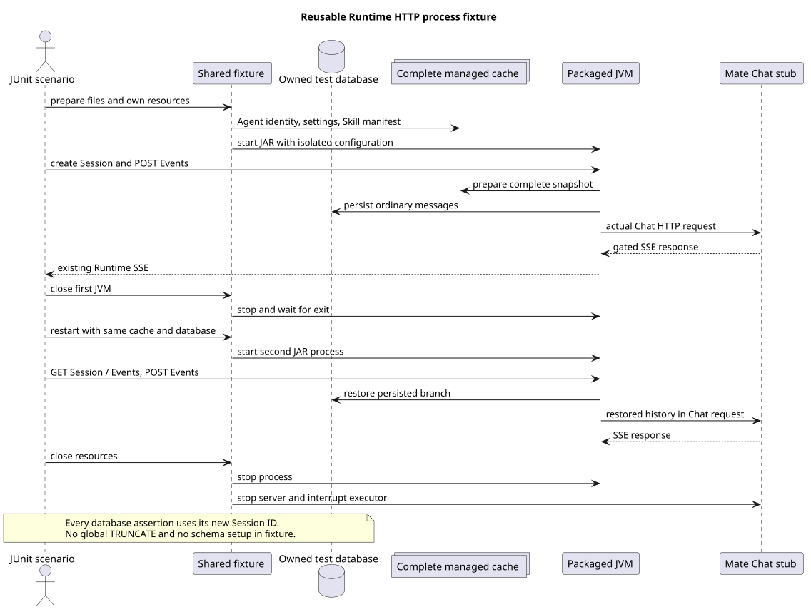

# Runtime HTTP 服务启动与重启测试

> 版本：1.0.0 · 日期：2026-09-07 · 状态：Implemented

本次提取可复用的测试辅助代码：启动真实后端服务、发送 HTTP 请求，并在测试结束后关闭服务和相关资源。
Events 和重启恢复测试共用这些代码，各自保留业务断言。

## Context 与源码证据

本切片从实际已合入的 Java `b7f077d59b09362dc366241920a85b6d218d1189` 独立开发。
没有引用未合入 PR #241 的应用接口，也不修改独立设计仓。以下路径均相对于实现仓根目录。

| 源码路径与符号 | 基线观察行为 |
|---|---|
| `modules/coding-agent-cli/src/test/java/com/campusclaw/codingagent/runtimeapi/web/RuntimeHttpProcessOpenGaussIT.java`：`prepareRuntimeFiles/startRuntime/ModelStub` | 一个 694 行测试类内私有地管理目录、JAR 进程、HTTP 和模型桩；旧测试环境只写 settings/SYSTEM，使用本地 customModels 与 `/v1/chat/completions`。 |
| `modules/coding-agent-cli/src/main/java/com/campusclaw/codingagent/runtime/AgentRuntimeManager.java`：`prepareCached/loadSnapshot/loadSkills` | 完整缓存要求 agent.json、settings.json、SYSTEM.md、agents 与 skills 子目录，并校验 manifest、目录和 Skill 正文身份。 |
| `modules/coding-agent-cli/src/main/resources/application.yml`：`campusmate` | 实际部署要求共享 Mate base-url，受管目录由 `campusmate.runtime.agents-root` 配置。 |
| `modules/coding-agent-cli/src/main/java/com/campusclaw/codingagent/runtimeapi/model/MateRuntimeModelManager.java`：`resolveModel` | 从绑定模型 ID 创建 Mate Provider 模型，不消费旧测试环境的本地 customModels。 |
| `modules/ai/src/main/java/com/campusclaw/ai/provider/mate/MateServiceModelManagerProvider.java`：`eventFlux/endpoint` | 使用共享 base-url 和 `/mate-service/` 内模型路径发送真实 HTTP 请求。 |
| `modules/coding-agent-cli/src/main/java/com/campusclaw/codingagent/runtimeapi/persistence/MyBatisRuntimeSessionRepository.java`：`acceptUserEvent/finishExecution/updateThinking/updateModel` | 一轮接受/终止改变版本，两次配置修改各升版本并追加对应领域 Entry。 |

旧测试环境与主干生产配置已经不一致；因此本次不仅移动方法，还恢复当前主干实际入口的验收。
这是 **Java 测试架构调整**，不以 pi 作为测试辅助代码的设计基线，不把 Java 跨进程测试描述成上游行为。

新增实现证据单独绑定代码提交 `0a2c00b945f43bea7528875f1503bb662e2e3b56`，不归到上述基线：

| 新增源码路径与符号 | 本次实现 |
|---|---|
| `modules/coding-agent-cli/src/test/java/com/campusclaw/codingagent/runtimeapi/web/RuntimeHttpProcessFixture.java`：`prepareRuntimeFiles/startRuntime/loadConfiguration/ModelStub.close` | 完整缓存、当前 Mate 配置、外层配置读取、统一资源拥有者；两个 nested DTO 只承载数据。 |
| `modules/coding-agent-cli/src/test/java/com/campusclaw/codingagent/runtimeapi/web/RuntimeHttpProcessFixtureTest.java`：`testCompleteCachePreservesSkillBinding/testCloseInterruptsGateAlreadyOwnedByHandler` | 真实 Manager 缓存和活动 handler 的关闭断言。 |
| `modules/coding-agent-cli/src/test/java/com/campusclaw/codingagent/runtimeapi/web/RuntimeHttpProcessOpenGaussIT.java`：`testPackagedJarRestartsWithPersistedHistory` | 关闭第一 JVM，重启后断言 GET 结果及实际模型输入恢复。 |

## 关键定义

- `RuntimeHttpProcessFixture`：同包可复用的测试辅助代码，负责准备完整目录、启动真实后端服务、发送 HTTP 请求及关闭资源。
- `ModelStub/ModelGate`：只在当前 Mate Chat 路径提供真实 SSE；其他路径返回 404，不能伪装 Manager 元数据。
- `ProcessTestConfigDTO/SessionViewDTO`：测试内部传递的连接参数与带 ETag 的 Session JSON，不是公开契约。
- `RuntimeHttpProcessOpenGaussIT`：保留业务断言的测试类；既有 Events 场景和新增重启场景共用上述辅助代码。

## 架构与数据流



[PlantUML 源码](diagram.puml#L1)

测试在 JUnit 临时目录写完整 Agent 缓存，包含名称、说明、使用示例、双模型绑定，以及一个
`disable-model-invocation: true` 的 Skill。真实 `AgentRuntimeManager.prepareCached` 单元验证确认该
Skill 仍属于完整绑定快照，但当前 `RuntimeAgentPromptLoader` 不将它放进模型可见摘要。
这不是 Skill 执行或 Command HTTP 已经通过验收的声明。

`startRuntime` 启动实际打包 JAR，隔离工作目录、Home、监听地址、数据库和 Mate 地址；不注入测试 Bean。
模型桩只服务 Chat，完整缓存缺损导致的 Manager 请求不能误得到模型成功响应。启动探针调用现有
GET Session，直到出现预期 404 或进程退出/超时；每次启动日志按端口区分。

## 设计决策

参见 [ADR-0068](../../decisions/0068-reuse-runtime-http-process-fixture.html)。

1. 提取实际使用的包级设施，不新增生产接口、测试启动模式或第三方依赖。
2. 保留真实网络、SSE、JDBC、打包启动及完整缓存的边界；不以 MockMvc 代替跨进程验收。
3. 删除旧全表 TRUNCATE。数据库断言都按本次创建的 Session ID 过滤，不需要清空其他测试数据。
4. 使用者必须指向预先初始化的专用测试数据库；测试辅助代码不初始化表，也不对用户数据库运行安装 DDL。
5. 模型响应计数用 AtomicInteger；测试辅助代码管理虚拟线程 executor。关闭先停止服务，再中断并关闭 executor，
   已由 handler 取得的 gate 也能解除等待；每个 exchange 在 finally 关闭。

## 边界情况与 DFX

- 缺少连接参数或打包 JAR 时明确跳过，不能把该结果当作真实验收成功。
- 缓存损坏在 prepareCached 返回空，单元验证无 Mate 访问；不放松生产完整性规则来配合测试。
- 每次新建 Session 使用服务生成的 ID；同一专用数据库连续运行无需 TRUNCATE。
- 模型 gate 等待、HTTP 连接和进程就绪使用有限超时；停止进程先正常退出，再强制终止兜底。
- 本次测试期间的端口及临时文件不属于生产配置；进程日志只保留在测试临时目录。
- 资源拥有者均采用 try-with-resources，断言失败同样清理；无生产单例或数据库结构修改。

## 契约改动

无公开 HTTP、JSON、SSE、Entry 类型或产品行为改动。调整的是落后的测试配置和对应断言：
两个模型仍来自有序绑定；初始 thinking=true；旧场景版本仍为 5（初始 1、接受 2、idle 3、两次配置各加 1）。
数据库历史在六条消息之后还包含主干已经实现的 thinking/model 领域 Entry；同值配置仍不写 Entry。

## 测试

- 5 个辅助代码单元测试：完整真实缓存与重新读取、损坏缓存拒绝、真实模型 HTTP/gate、活动 gate 关闭和非 Chat 路径拒绝。
- 原真实 Events 场景：SSE 顺序、Steer/FollowUp、分页、Model/Thinking、ETag 幂等与 412、数据库状态、删除、Abort。
- 新真实重启场景：第一 JVM 实际退出后，第二 JVM 读取同一 Session/ETag 和历史；再次提交普通 Events，
  检查真正到达 Mate 桩的请求同时包含持久化用户和助手消息。
- 未来 Commands IT 可复用包内启动、目录、Session、HTTP 和模型 gate；最终路由验收仍由对应 HTTP PR 实现。

## 验证与运行

先打包当前主干生产代码，再对拥有的专用 openGauss 数据库执行测试：

```bash
./mvnw -q -pl :campusclaw-coding-agent -am package -DskipTests
./mvnw -q -pl :campusclaw-coding-agent -am test \
  -Dtest=RuntimeHttpProcessFixtureTest,RuntimeHttpProcessOpenGaussIT \
  -Dsurefire.failIfNoSpecifiedTests=false \
  -Druntime.it.jar=/absolute/path/to/campusclaw-agent.jar \
  -Dgaussdb.it.url=jdbc:postgresql://127.0.0.1:45433/runtime_fixture \
  -Dgaussdb.it.username=fixture_user -Dgaussdb.it.password='<test-only-password>'
```

交付还执行 Spotless、Checkstyle、测试质量检查、Java AST 方法长度检查、镜像同步、PlantUML/SVG/XML、
文档链接、HTML 渲染与 `git diff --check`，实际次数、提交和新增行数记录在 PR。公司 NativeParent 不可解析时，
镜像源码同步与公司编译分别报告，不能把显式 `--no-verify` 当作公司编译通过。

代码提交验证：7 项定向测试（5 单元、2 真实 openGauss/JAR IT）均通过且无跳过；测试质量 0 error / 0 warning；
最终代码的完整 `./mvnw -q verify` 通过 1764 项普通测试；真实 IT 另行显式执行，不计入普通测试数量。
Java AST 无方法长度违规，两个纯数据 record 的布局另作人工核对。模块侧新增 652 行，镜像后门禁为 1304/2000。

## 版本历史

| 版本 | 日期 | 说明 |
|---|---|---|
| 1.0.0 | 2026-09-07 | 提取可复用的真实进程设施，恢复主干 Mate/完整缓存入口，移除全表清理并增加重启验证。 |
