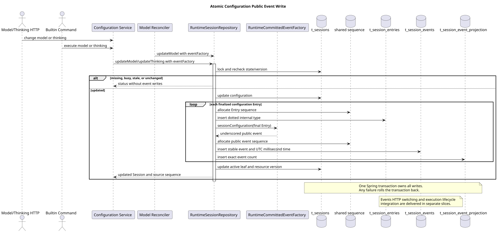

# Runtime v2 公共事件构造与配置写入

| 属性 | 值 |
|---|---|
| 版本 | 0.1.0 |
| 日期 | 2026-09-08 |
| 契约基线 | `pi-mono-java-design@2ee2a3211da68ad87b0d9cab353e691b00bdaebd` |
| 变更前 Java | `pi-mono-java@f5c3a755` |
| 实现提交 | `1120583b`、`f818a41f`、`2dd80793`、`d14e706d` |
| pi 基线 | `pi-mono@5cd93f688aaab89dbb6dfa4aca535f21796ae185` |
| 当前范围 | 公共事件工厂、字段规范化，以及模型/Thinking 配置事件的原子写入；Events HTTP 的完整切换由后续集成片完成 |

## Context

Events v2 要求 POST SSE 的完整帧与 GET 历史读取同一份已提交公共事件。配置接口、Builtin
Command 和接受消息前的模型校准都会产生模型或 Thinking 配置 Entry。如果这些入口只写内部
Entry，历史完整性门禁会关闭失败；如果 Service 在配置事务提交后另写公共事件，进程故障又会留下
无法修复的半份历史。

本片建立一个公共事件工厂，并把配置状态、内部 Entry、公共事件和精确投影标记放入现有 Session
Repository 事务。它不改变配置 HTTP 的响应模型，也不修改 Command 的请求分派。

## 源码证据与实现边界

| 分类 | 仓库相对路径与符号 | 观察、决定和理由 |
|---|---|---|
| 已实现 | `modules/coding-agent-cli/src/main/java/com/campusclaw/codingagent/runtimeapi/event/RuntimeCommittedEventFactory.java` · `sessionConfiguration` | 以已经定稿的 `RuntimeEntryDTO` 为锚点生成 `CommittedEventDTO`；配置内部点号类型转换为 v2 公共下划线类型 |
| 已实现 | `modules/coding-agent-cli/src/main/java/com/campusclaw/codingagent/runtimeapi/persistence/RuntimeSessionRepository.java` · `updateModel/updateThinking` | 组合重载接收 Entry 工厂和公共事件工厂，使配置写入只有一个事务边界 |
| 已实现 | `modules/coding-agent-cli/src/main/java/com/campusclaw/codingagent/runtimeapi/persistence/MyBatisRuntimeSessionRepository.java` · `appendConfigurationEntries` | 在 Session 行锁下分配共享序号，依次写 Entry、公共事件和精确投影标记；任一步失败回滚配置状态与全部追加记录 |
| 已实现 | `modules/coding-agent-cli/src/main/java/com/campusclaw/codingagent/runtimeapi/service/command/SessionModelConfigurationService.java` · `update` | HTTP 模型配置与 Builtin `model` Command 共用同一个公共事件写入点；模型不再支持 Thinking 时，同一事务可产生两组 Entry/公共事件 |
| 已实现 | `modules/coding-agent-cli/src/main/java/com/campusclaw/codingagent/runtimeapi/service/command/SessionThinkingConfigurationService.java` · `change` | HTTP Thinking 配置与 Builtin `thinking` Command 共用同一个公共事件写入点 |
| 已实现 | `modules/coding-agent-cli/src/main/java/com/campusclaw/codingagent/runtimeapi/session/RuntimeSessionModelReconciler.java` · `reconcile` | 接受消息前发现模型失效时，自动回退也写入相同的配置公共事件 |
| 已观察 Java 调用者 | `modules/coding-agent-cli/src/main/java/com/campusclaw/codingagent/runtimeapi/web/RuntimeSessionConfigurationController.java`、`service/command/contributor/ModelCommandContributor.java`、`ThinkingCommandContributor.java` | HTTP 与 Builtin Command 只复用配置 Service；本片没有在这些入口复制事件构造逻辑 |
| pi 观察 | `packages/agent/src/agent-loop.ts` · `runLoop` | pi 依次发出消息、工具和轮次事件，未提供 CampusClaw 的 Session 配置资源、数据库事务或 HTTP 公共事件投影 |

公共事件表、完整性标记和配置资源是 CampusClaw 架构变化。内部点号类型继续服务既有 Entry 恢复，
公共下划线类型是产品 HTTP 契约；两者分离也避免改写旧 Entry 和 SQL 类型集合。

## 关键定义

- **内部 Entry**：模型恢复和 Session 状态使用的 `RuntimeEntryDTO`。它保存内部类型、父节点、内部序号与 payload。
- **权威公共事件**：由 `RuntimeCommittedEventFactory` 从已定稿领域对象生成的 `CommittedEventDTO`。
  配置事件的 `eventId` 使用锚点 Entry ID，`createdAt` 使用 Entry 时间并在写库前统一为 UTC 毫秒。
- **精确投影标记**：`t_session_event_projection` 记录每条 Entry 的公共事件数量。本片的每条配置
  Entry 恰好对应一条公共事件。
- **组合配置写入**：Repository 在一个 Spring 事务内更新 Session 配置、追加 Entry、公共事件和标记。

## 架构与数据流

[PlantUML 源码](diagram.puml#L1)

`RuntimeSessionConfigurationController` 与 Builtin Command contributor 都进入
`SessionModelConfigurationService` 或 `SessionThinkingConfigurationService`。自动模型回退从
`RuntimeSessionModelReconciler` 进入相同 Repository 组合重载。Service 只负责配置准入、领域 Entry
和调用编排；公共 JSON 字段由唯一工厂生成，Repository 负责锁、序号和事务。

模型切换可能同时关闭 Thinking。此时 `entriesFactory` 产生 `session.model.changed` 和
`session.thinking.changed` 两条内部 Entry，Repository 按列表顺序逐条写入对应的
`session.model_changed` 和 `session.thinking_changed` 公共事件。相同配置返回 `UNCHANGED`，不分配
序号，也不生成 Entry、事件或标记。

公共事件工厂还为执行链提供 user、agent、tool、idle 和 compacted 的统一构造入口。执行链是否已经
调用组合 append 属于执行生命周期交付；仅有工厂方法不代表该入口已经接通。工厂在边界处完成以下
已确认规范化：

- user.message 只接收调用者明确提供的安全公开文本和 fileId，不从内部 Skill 正文反推回执；
- Agent 正文只取文本块，不公开原始 Thinking；Thinking 摘要由调用者先证明来源可信；
- CallMateTool 的公开参数保持 `{tool,args}`，缺少 `args` 时补空对象，其他空工具参数使用空对象；
- 工具失败和 idle 失败保存接受时语言对应的固定公开文案，GET 不重新翻译；
- 未知 Usage 或 Cost 省略，避免把缺失信息表达为已知零值。

## 设计决策

见 [ADR-0081：统一公共事件工厂并原子持久化配置事件](../../decisions/0081-atomic-public-event-writers.html)。

采用 Repository 函数参数，使公共事件只能基于已经获得父节点和内部序号的最终 Entry 构造，同时沿用
现有事务。Service 先写 Entry 再开启第二个事务无法保证故障原子性，因此不采用。把每个 HTTP、Command
或校准入口分别编码 JSON 会产生字段和类型漂移，因此也不采用。

接口中保留不带公共事件工厂的旧配置重载，供尚未迁移的内部调用者兼容。该入口不会证明 v2 投影完整，
不能用于新的公开配置写入点；生产配置 Service 和自动校准已全部使用组合重载。

## 边界情况与 DFX

- Session 不存在、忙、资源版本不匹配或目标值未变化时，沿用既有配置状态机，不产生公共事件。
- 模型切换导致 Thinking 自动关闭时，两条配置事件使用同一锁内顺序，客户端按提交数组顺序读取。
- 公共 eventId 冲突、payload 无法构造、锚点不匹配或事件插入失败时，数据库回滚 Session 配置、Entry、
  公共事件、标记、active leaf 与共享序号。
- 每条配置 Entry 增加一条 `t_session_events` 和一条 `t_session_event_projection` 写入；同值请求没有新增
  写放大。事务不包含模型请求、工具执行或网络输出。
- 沿用 Session 主行锁和共享 sequence，不增加后台线程、缓存、网络调用或 Maven 依赖。
- 配置 Entry 保留在内部事件分支并推进 active leaf；`RuntimeEntryCodec` 不把配置 payload 当作模型对话正文。
  公共 payload 只包含契约字段，不暴露 entrySeq、parentId 或内部类型。

## 契约与交付范围

本片使 `PUT /sessions/{sessionId}/model`、`PUT /sessions/{sessionId}/thinking`、对应 Builtin Command
以及自动模型校准共享配置公共事件写入点。配置接口仍返回原有 Session Response VO；Builtin Command
仍使用现有 JSON 响应。公共事件将在 Events v2 历史中出现，不向配置响应额外嵌入事件。

本片没有单独切换 `GET/POST /sessions/{sessionId}/events` 的生产 Controller，也不代表所有执行期写入点、
迁移门禁和 SSE 生命周期已经完成。完整 Events HTTP 只在公共写入点、旧数据安全迁移、读取和请求流一起
通过集成验证后切换。

## 测试与验证

`RuntimeCommittedEventFactoryTest` 使用真实 Jackson 投影验证安全 user 回执、正文/Usage、工具参数、固定
错误文本、未知 Usage/Cost 省略和配置类型转换。配置 Service 与自动校准测试验证组合工厂被调用、同值不
写事件、模型能力变化产生正确顺序。`RuntimeSessionRepositoryOpenGaussIT` 使用真实 openGauss 验证模型、
Thinking 与名称 Command 的差异、事件时间毫秒精度、完整性标记，以及事件主键冲突时配置、Entry 和序号
整体回滚。

writers 集成树已运行 121 项相关测试并通过，Spotless 与 Checkstyle 通过。文档交付另验证 PlantUML
生成、ASCII 限制、SVG XML、Markdown 链接/锚点和 `git diff --check`。企业镜像由集成发布任务统一生成，
本独立文档提交不修改镜像。

## 版本历史

| 版本 | 日期 | 变更 |
|---|---|---|
| 0.1.0 | 2026-09-08 | 记录统一公共事件工厂、字段规范化和配置公共事件原子写入 |
