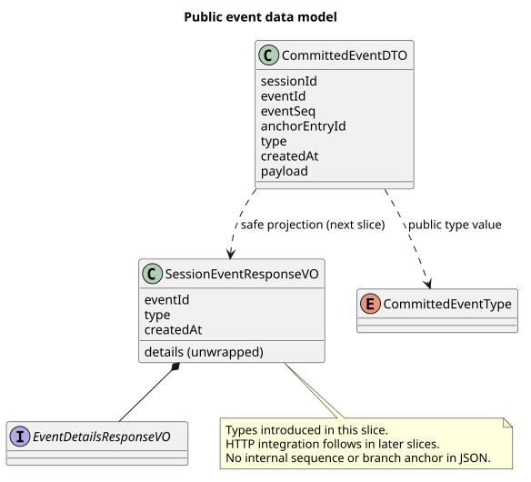
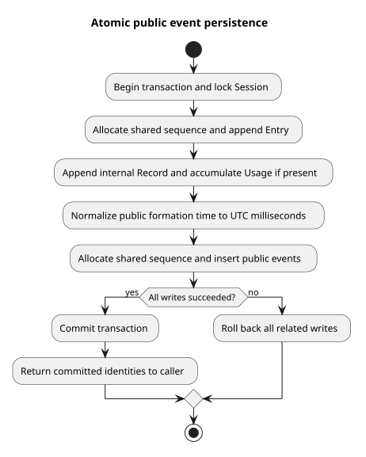

# Runtime 公共事件投影与存储

| 属性 | 值 |
|---|---|
| 版本 | 0.2.0 |
| 日期 | 2026-09-08 |
| 契约基线 | `pi-mono-java-design@2ee2a3211da68ad87b0d9cab353e691b00bdaebd` |
| 实现基线 | `pi-mono-java@2f52e9b8` |
| 子 agent 数据模型提交 | `b7034350`、`8ca53f58` 的 DTO、VO、类型和共享常量 |
| 本片实现证据 | 公共投影 `8ca53f58`；组合事务 `d8276302`；时间精度修复与真实库回归 `87b3dadb` |
| 本片范围 | v2 数据对象、安全公共投影、Entry/Usage/公共事件的原子写入；HTTP 入口尚未切换 |

## Context

Events v2 要求 POST 完整帧与 GET 历史使用同一事件对象，内部 Entry 与 Record 仍服务于上下文恢复和累计 Usage。
不能将内部持久化对象直接作为响应返回，也不能把当前旧 SSE 的 `event/id/data` 包装当成新契约。
数据模型片建立共用类型，本片继续实现公共字段投影与同事务存储，为历史查询和 SSE 接入提供基础。

## 关键定义与源码证据

以下 Java 路径相对 `modules/coding-agent-cli/src/main/java/com/campusclaw/codingagent/runtimeapi/`。

| 分类 | 路径与符号 | 行为与理由 |
|---|---|---|
| 已有实现 | `event/RuntimeEntryCodec.java#toSseData`、`vo/RuntimeSseEventVO.java` | 旧接口从内部 Entry 转换并使用旧 SSE 包装，尚不是 v2 公共记录 |
| 本片新增 | `dto/CommittedEventDTO.java` | 内部传递 Session、事件标识、提交序号、分支锚点、形成时间和安全业务 JSON |
| 本片新增 | `vo/SessionEventResponseVO.java` | 响应只暴露公共字段；业务 VO 展开到根对象，不暴露 DTO、序号和锚点 |
| 本片新增 | `event/CommittedEventType.java` | 关闭公共完整事件的 11 种类型集合，未知类型不作为已知事件处理 |
| 本片新增 | `event/CommittedEventProjection.java#project` | 验证权威记录的完整字段，生成类型化只读响应，保留已经保存的语言文本 |
| 本片新增 | `persistence/MyBatisRuntimeSessionRepository.java#acceptUserEvent/appendEntry/appendEntryWithUsage` | 重载方法在既有 Session 事务内写 Entry、内部 Record/Usage 和公共事件，保留旧签名供未切换的入口使用 |
| 已确认目标，后续实现 | 设计仓 `接口契约-v2/common.json`、POST/GET 操作文档 | 分页、执行控制、旧数据迁移和 HTTP 输出尚未由本片接入 |

pi 基线 `5cd93f688aaab89dbb6dfa4aca535f21796ae185` 的
`packages/agent/src/agent-loop.ts#runLoop` 产生内核消息和工具生命周期通知。
它没有本项目的 HTTP 公共事件表、毫秒形成时间和分支查询协议；这些是 CampusClaw 的架构变更。

## 架构与数据流

[PlantUML 源码](diagram.puml#L1)

[PlantUML 事务源码](diagram.puml#L37)

## 设计决策

见 [ADR-0074](../../decisions/0074-share-public-event-data-model.html)。持久化使用可变 `@Data` DTO；响应使用
只读字段和类型化 VO。`@JsonUnwrapped` 展开业务字段；工具结果显式声明 `isError` JSON 属性，
避免 JavaBean 布尔命名推断产生错误的 `error` 字段。可选字段为 null 时省略；delta 的 `createdAt` 省略。
参数校验仍由未来请求 VO 承担，响应对象不添加请求校验。投影对内容块列表与工具参数中的嵌套集合进行复制和冻结。

新增 `t_session_events` 只存公共业务字段、稳定事件标识、形成时间、提交序号和所属 Entry 锚点。
公共事件与 Entry、内部 Record 共享 Session 序号分配器；先持有 Session 行锁，再分配序号，
同一事务中任一步失败都回滚，不能在 Entry 或 Usage 提交后另开事务补写公共事件。
数据库与 Mapper 参数继续使用 DTO；查询由后续片实现，数据库内部标识不会进入公共响应。

公共时间写入前统一为 UTC 毫秒并回填 DTO，使 POST 使用的内存对象与数据库读回值一致。
这是必要的规范化：`TIMESTAMPTZ(3)` 会对更高精度四舍五入，而 Java 的毫秒文本格式化会截断。
清理 Session 时先删除其公共记录，再按既有流程清理 Entry、Record、统计和资源。

## 边界情况与性能

投影只接受完整事件；正文和摘要必须为 `phase=completed`，Usage/cost 必须为非负数值。
缺失字段、未知类型、非法内容块和不安全错误码使本次读取失败，不静默过滤后声称历史完整。
工具结果必须有 `isError`，失败必须有受支持错误码，成功不能携带错误码；执行失败必须有保存的安全错误消息。
投影不负责把原始 Provider 思考归为可公开摘要，不能把未经判定的 thinking 记录直接写入公共表。
公共工具结果只定义文本块；思考只承载允许公开的摘要，不意味着可以公开内核所有 thinking 内容。
消息附件最多 4 个、标识为 32 位十六进制、拒绝说明最多 4096 字符；共同约束集中在 `ClawConstants.RuntimeApi`。
每条公共事件增加一次插入和一次共享序号递增；Session 行锁保持数据库事务内的提交顺序。
不在锁内等待 HTTP 写出、模型执行或工具确认；不新增线程、缓存或 Maven 依赖，使用已有 Jackson、Lombok 和 JDK 21。

## 契约与交付范围

本片提供 11 类完整事件字段、安全投影和原子写入，未切换 Controller、请求格式、分页或旧 SSE。
后续片必须将组合写入接到全部公开事件产生点，并实现旧数据的安全映射与固定执行控制，再切换 GET/POST。
不能根据数据类和表存在就认为完整 v2 已上线。
内部旧类型字面值保留，由公共投影转换，避免只改枚举而遗漏 SQL 白名单和历史数据。

## 测试与验证

独立序列化回归验证 `isError` 的真实 JSON 名称、delta 可选字段省略、完整帧时间与根字段展开。
JDK 21 下 `./mvnw -q -pl modules/coding-agent-cli -am spotless:apply checkstyle:check test
-Dtest=SessionEventResponseVOTest,ClawConstantsTest -Dsurefire.failIfNoSpecifiedTests=false` 通过，20 项测试无失败、错误或跳过。
Java AST 版权/方法长度检查没有 finding；已有 Unicode 正则和两个 sealed 业务接口的布局已人工补查。
测试质量缓存脚本检查 0 错误、0 提示。

本片新增投影全类型序列化、非法持久化记录拒绝、参数深复制，以及组合仓储共享序号回归。
JDK 21 下 `CommittedEventProjectionTest`、`MyBatisRuntimeSessionRepositoryTest`、`SessionEventResponseVOTest`
与 `CommittedEventAtomicRepositoryOpenGaussIT` 共 19 项通过，含真实 openGauss 7.0.0-RC3 的两个事务用例；
Spotless 和 Checkstyle 同时通过。数据库验证 UTC 毫秒时间往返一致，以及公共插入失败时
Entry、Record、Usage/cost、messageCount、activeLeaf 和共享序号全部回滚。
企业镜像由 `sync-campusclaw.sh` 生成。本机无法解析公司 `NativeParent`，按普通本地流程使用 `--no-verify`；
企业环境编译仍未验证。PlantUML 生成、ASCII、SVG XML、Markdown 链接/锚点和 `git diff --check` 均须通过。

## 版本历史

| 版本 | 日期 | 变更 |
|---|---|---|
| 0.2.0 | 2026-09-08 | 实现安全公共投影与原子存储，保留 HTTP 切换和旧数据迁移边界 |
| 0.1.0 | 2026-09-08 | 定义公共事件 DTO/VO 与共享类型，明确后续接入边界 |
