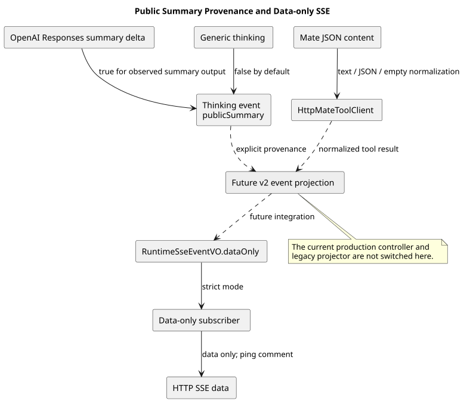

# 公共事件流输出基础

| 属性 | 值 |
|---|---|
| 版本 | 0.1.1 |
| 日期 | 2026-09-08 |
| 设计契约 | `pi-mono-java-design@2ee2a3211da68ad87b0d9cab353e691b00bdaebd` |
| 变更前 Java | `d9a207779911eb286e1579119fb45a972092efe4` |
| 本片实现 | SSE 净补丁 `4687ef06`；摘要标志 `c0004604`、`8bf2f997`、`46d3e13e`；Mate 内容 `74569cd3` |
| pi 基线 | `5cd93f688aaab89dbb6dfa4aca535f21796ae185` |
| 范围 | data-only SSE 编码、可信公开摘要标志和 Mate 工具结果文本规范化；当前生产 Controller 和旧投影器尚未切换 |

## Context

Events v2 要求事件只通过 SSE 的 data 字段发送，不使用 event/id 字段；完整事件和增量的
公开字段由应用投影层决定。历史与 SSE 也只能公开提供商明确产生的推理摘要，不能根据通用
ThinkingContent 的存在推断其可公开。本片为后续完整事件运行链提供这些基础能力。

## 源码证据与分类

| 分类 | 仓库相对路径与符号 | 观察、决定和理由 |
|---|---|---|
| 变更前 Java | `modules/coding-agent-cli/src/main/java/com/campusclaw/codingagent/runtimeapi/web/RuntimeSseEmitterSubscriber.java#onEvent/onHeartbeat` | 旧协议写 event、可选 id 和 data，心跳文本为 heartbeat；v2 必须选择独立编码模式 |
| 变更前 Java | `modules/coding-agent-cli/src/main/java/com/campusclaw/codingagent/runtimeapi/event/RuntimeEntryCodec.java#encodedSseBytes` | 旧容量计数序列化整个内部 VO；v2 data-only 模式应计算实际 data JSON 的 UTF-8 字节数 |
| 变更前 Java | `modules/ai/src/main/java/com/campusclaw/ai/provider/openai/OpenAIResponsesProvider.java#handleResponseEvent/applyThinkingDelta/handleOutputItemDone` | Responses 的 reasoningSummaryTextDelta 已有独立入口，但通用 thinking 事件没有携带安全来源标志 |
| 既有消费者 | `modules/agent-core/src/main/java/com/campusclaw/agent/loop/AgentLoop.java#extractAssistantMessage` | 内部循环读取 partial；增加标志不改变模型上下文内容 |
| 既有消费者 | `modules/coding-agent-cli/src/main/java/com/campusclaw/codingagent/runtimeapi/event/RuntimeEventProjector.java#projectThinking` | 旧投影器尚不消费新标志；本片不宣称旧 HTTP 已获得 v2 隐私投影保证 |
| 已实现 | `modules/coding-agent-cli/src/main/java/com/campusclaw/codingagent/common/client/HttpMateToolClient.java#toToolResult` | JSON 字符串使用 asText，对象或数组保留 JSON 文本，缺失或 null 变为空字符串；避免工具结果二次引号与转义 |
| pi 观察 | `packages/ai/src/api/openai-responses-shared.ts:602`、`:685` | pi 的 delta 源于 reasoning_summary_text；完成时还允许从 item.content 回退。这是内核思考内容，不等同 CampusClaw 公开摘要 |

严格区分摘要来源属于 CampusClaw 安全加固。HTTP 的 data-only 模式是产品契约变化；pi
内核的事件对象不能直接当作本服务的 SSE wire 格式。

## 架构与数据流

[PlantUML 源码](diagram.puml#L1)

`RuntimeSseEventVO.dataOnly` 构造含 type 的 data，拒绝空 type 和重复 type；内部 dataOnly
字段用 JsonIgnore 排除，保留旧 VO 的 JSON 字段集合。`RuntimeSseEmitterSubscriber` 的新模式
只接受 data-only 事件，写出 data 和空行；心跳严格为 `: ping\n\n`。旧构造器保留当前调用行为。

ThinkingStart/Delta/End 的旧构造器默认 publicSummary=false。OpenAI Responses 只有收到明确
的 reasoning_summary_text.delta 后才把该 output 标为公开；结束事件使用该 output 的标志，
正文仍来自已收集摘要。单纯 reasoning item 的开始或结束不证明有可公开摘要。其他提供商
保持默认私有，后续需依据各自可信来源增加适配。

Mate 工具结果只在网关适配边界规范化正文：字符串直接成为文本，对象和数组序列化为 JSON 文本，
缺失或 null 统一为空字符串。认证头、工具权限和错误分类沿用既有处理。

## 边界、性能与决策

- 模型正文、通用原始推理和私有签名不因本片自动公开；后续 v2 投影器必须消费可信标志。
- 本片没有实现事件受理、eventId 持久化、结果段订阅或 idle 关闭；应在完整运行链接入后验证这些性质。
- data 容量计算包含实际 JSON UTF-8 字节，不把内部开关计入旧帧容量；后续响应队列继续承担容量和慢消费者处理。
- 摘要标志保存在每次模型流的内存集合，大小随该响应的 output 数量增长，并随流状态释放；不增加后台线程、网络请求或数据库表。
- 不新增 Maven 依赖，复用已有 Spring MVC、Jackson、OpenAI SDK 与测试依赖。

见 [ADR-0079](../../decisions/0079-public-stream-boundary.html)。

## 测试与验证

测试使用真实 SseEventBuilder 检查 data-only 帧、精确心跳和拒绝旧帧；使用真实 Jackson 比较
新模式与旧模式的字节计数及字段；提供商测试由 MockWebServer 返回摘要流和无摘要 reasoning
item，验证至少一个真实事件及相应标志。集成审查独立运行 AI 事件与提供商测试 41 个、SSE 与字节计数测试 9 个、Mate 客户端测试 35 个，
共 85 个测试通过。Mate 测试同时断言四种 JSON 内容的精确输出。Java 方法长度、格式和镜像另行检查。
测试质量脚本对 Mate 既有异常与辅助断言报告的 6 项已逐一人工核查：均有真实异常或请求头断言，
并非缺少断言；保留脚本结果，不将其描述为脚本零错误。

企业镜像同步使用普通本地环境允许的生成模式；企业 NativeParent:26.0.0-SNAPSHOT 在本地
不可解析，企业镜像编译尚未验证。测试不构成生产性能或端到端 v2 HTTP 已完成的证明。

## 版本历史

| 版本 | 日期 | 变更 |
|---|---|---|
| 0.1.1 | 2026-09-08 | 补充 Mate 工具文本规范化和 85 个集成复验结果 |
| 0.1.0 | 2026-09-08 | 增加 data-only SSE 支持和基于真实提供商摘要事件的公开标志 |
