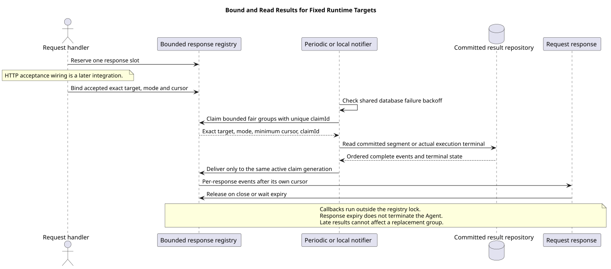

# 有界等待与跨实例结果补读

| 属性 | 值 |
|---|---|
| 版本 | 0.1.0 |
| 日期 | 2026-09-08 |
| 契约 | `pi-mono-java-design@2ee2a3211da68ad87b0d9cab353e691b00bdaebd` |
| Java 基线 | 固定结果读取 `43a8e000`，已包含主线 `80ca6cc9` |
| 实现 | `606e27a1`；过期领取隔离 `f5e904aa`；快通知共享退避 `bb8047fe`；来源 `d2f5dff7` / `f1895651` |
| pi 基线 | `pi-mono@4af9d21d3b4d664e4a29fcabfec85171077248e3` |
| 范围 | 响应容量预留、固定目标登记、结果检查和提交后本机通知；HTTP 接受和路由切换另行集成 |

## Context

中断或确认请求可能由另一实例接受。原实例继续执行并提交公共事件，接收请求的实例只读取已经提交的结果。
需要限制实际等待响应数量、共享同一目标的查询，同时让每条响应拥有自己的游标和关闭生命周期。

## 源码证据与理由

| 分类 | 仓库相对路径与符号 | 观察与理由 |
|---|---|---|
| 契约 | `01-总体架构/01-CampusClaw多Agent运行时/chat-events-v2-design.md` §4.4～§4.5 | 固定执行身份、数据库结果补读、本机快速通知和轮询兜底，不通过超时推断执行结束 |
| 已实现 | `modules/coding-agent-cli/src/main/java/com/campusclaw/codingagent/runtimeapi/event/RuntimeResultWaitRegistry.java` · `reserve` / `bind` / `claimTargets` / `deliver` | 按实际响应计数；同模式、同完整目标共享查询，每个响应独立推进游标 |
| 已实现 | `modules/coding-agent-cli/src/main/java/com/campusclaw/codingagent/runtimeapi/dto/ResultWaitTargetDTO.java` · `claimId` | 每次领取生成身份，迟到查询不能关闭或释放同目标的新一代等待组 |
| 已实现 | `modules/coding-agent-cli/src/main/java/com/campusclaw/codingagent/runtimeapi/event/RuntimeResultPollingService.java` · `poll` / `notifyCommitted` | 周期补读与单工作线程通知共用登记表，数据库失败后退避，队列满时保留周期兜底 |
| 已实现 | `modules/coding-agent-cli/src/main/java/com/campusclaw/codingagent/runtimeapi/persistence/MyBatisRuntimeExecutionResultRepository.java` | 只读事务增加可配置查询超时，不改变固定身份和首个 idle 上界 |
| pi 观察 | `packages/agent/src/agent-loop.ts` · `runAgentLoop` | pi 本地事件循环没有 CampusClaw 跨实例 HTTP 响应登记表；本机制属于项目架构变化 |

## 关键定义与流程

- Reservation 先占用一个实际响应名额，之后才能绑定受理事务返回的完整执行目标与回执之后的内部序号。
- `SEGMENT_EVENTS` 读取当前响应段的完整事件，停在该段第一个 idle；`EXECUTION_TERMINAL` 只等原根执行的真实终态。
- 同一完整 target 和模式形成查询组。组可以有多个响应，每个响应保存独立 `afterSeq`。
- 每次领取带唯一 `claimId`；投递、释放和终结都同时核对组键、正在领取状态及此身份。

[PlantUML 源码](diagram.puml#L1)

查询和响应回调在登记表锁外执行。批量领取按轮转顺序选择目标，避免总是查询同一批。
响应关闭或到期只解除对应登记，不停止 Agent、不改数据库执行状态，也不伪造 idle。
当一组等待者已移除、同一目标又建立新组时，旧查询返回的事件、空终态或释放动作均不作用于新组。

## 配置、资源与故障边界

| 配置项（`campusclaw.runtime.events`） | 默认值 | 含义 |
|---|---|---|
| `result-wait-max-responses` | 256 | 实际响应上限，重复目标也各占一个名额 |
| `result-wait-timeout` | 30m | 响应等待期限，到期只关闭本响应 |
| `result-poll-interval-ms` | 500 | 定时检查间隔 |
| `result-poll-batch-size` | 100 | 一轮检查的目标组上限及本机通知队列上限 |
| `result-read-limit` | 200 | 单个段的一批完整事件数 |
| `result-query-timeout-seconds` | 2 | 只读事务的数据库查询时限 |
| `result-poll-failure-backoff` | 2s | 查询失败后的退避 |

周期检查不重入。提交后通知使用一个虚拟工作线程和有界队列；正在领取的同目标不会重复并发查询，队列满不阻塞提交方，
后续周期检查继续补读。已排队通知也在领取前检查同一退避期限；查询失败先设定退避，再释放领取，
避免释放后立即被新通知重查。应用停止时关闭通知执行器。参数必须为正，不新增 Maven 依赖、Redis或实例间转发。
这些默认值是实施配置，不是企业生产性能承诺。慢消费者仍由请求流的双重缓冲上限处理。

本片尚未把 Reservation 与 HTTP 请求、完整回执和断连回调接线。接受前预留、接受后首帧顺序、
确认本机 preview 与完整事件去重、旧接口退役必须在后续统一 Events 接线中验证。
已有过期游标配置的清理由 GET 切换负责，本片的内部序号不构成公开 cursor 协议。

## 设计决策

见 [ADR-0085](../../decisions/0085-bound-runtime-result-waiting.html)。
按实际响应限制容量并按固定目标共享查询，避免重复目标绕过容量；领取身份避免旧查询跨代误投递。
只按组键或最新 Session 状态校验不能隔离迟到结果，因此不采用。

## 验证

验证登记名额耗尽、绑定后立即补读、独立游标、查询合并、轮询不重入、失败退避、期限到期和旧领取跨代隔离。
独立运行登记与检查服务 8 项回归通过，零失败、错误和跳过；包含先排队两个通知、首个查询失败后第二个不查库的确定性用例。
Java 方法与载体规范、格式检查通过；9 组源码与生成镜像一致，PlantUML 重生成、SVG XML 和文档链接检查通过。
企业镜像生成同步；本机无法解析 NativeParent 26.0.0-SNAPSHOT，企业 Maven 编译未验证。

## 版本历史

| 版本 | 日期 | 变更 |
|---|---|---|
| 0.1.0 | 2026-09-08 | 有界响应登记、固定目标补读、本机通知与过期领取隔离 |
