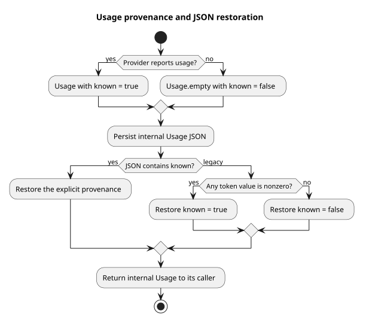

# 模型用量来源标志

| 属性 | 值 |
|---|---|
| 版本 | 0.1.0 |
| 日期 | 2026-09-08 |
| 设计契约 | `pi-mono-java-design@2ee2a3211da68ad87b0d9cab353e691b00bdaebd`，Events v2 Usage |
| 变更前 Java | `72f3550e` |
| 实现基线 | `001a37d0`，终态报告与 JSON 回归 `80481c53` |
| pi 基线 | `4af9d21d3b4d664e4a29fcabfec85171077248e3` |

## Context 与定义

Events v2 要求未知用量省略，明确报告的零用量仍保留五个 Token 字段。旧 Java 的
`Usage.empty()` 和提供商报告的五项零值相等，公共投影无法从数值判断来源。
`known` 表示上游明确报告过用量；它是内部来源信息，公开事件仍由独立 VO 映射限定字段。

## 源码证据与决定

| 分类 | 仓库相对路径与符号 | 观察与理由 |
|---|---|---|
| 变更前 Java | `modules/ai/src/main/java/com/campusclaw/ai/types/Usage.java#empty` | 零值占位没有来源信息，不能证明提供商实际报告零 |
| Java 实现 | `modules/ai/src/main/java/com/campusclaw/ai/types/Usage.java#fromJson/empty` | 显式保存 known；旧六参数构造代表已知用量，empty 代表未知；历史 JSON 无标志时仅非零 Token 证明存在报告 |
| Java 实现 | `modules/ai/src/main/java/com/campusclaw/ai/provider/openai/OpenAICompletionsProvider.java#handleChunk/partialFrom` | 收到 usage 后才设置标志，之前的增量与未报告的完成消息保持未知 |
| Java 实现 | `modules/ai/src/main/java/com/campusclaw/ai/provider/openai/OpenAIResponsesProvider.java#handleTerminalResponse/partialFrom` | completed、failed、incomplete 统一读取实际响应中的 usage，避免失败或长度截断时丢失已报告用量 |
| Java 实现 | `modules/ai/src/main/java/com/campusclaw/ai/provider/mistral/MistralProvider.java#finalUsage` | 完成消息不再把未知占位转换为已知零 |
| Java 消费者 | `modules/coding-agent-cli/src/main/java/com/campusclaw/codingagent/session/compaction/SessionCompactor.java#combineUsage` | 多次摘要调用合计已报告的数字；两次均未知时保持未知 |
| Java 持久化 | `modules/coding-agent-cli/src/main/java/com/campusclaw/codingagent/runtimeapi/event/RuntimeEntryCodec.java#usageRecord` | 内部 JSON 通过 Jackson 保存来源标志，不新增数据库列 |
| pi 观察 | `packages/ai/src/types.ts:382`、`packages/ai/src/api/openai-responses.ts:118`、`packages/ai/src/api/openai-responses-shared.ts:560` | pi 定义用量数值并在流开始时初始化零；没有同名 known 标志，不能直接满足本产品的公开省略语义 |

新增来源标志属于 CampusClaw 产品约束引起的架构变化，不宣称 pi 已有相同语义。
不新增 Maven 依赖，复用已有 Jackson、提供商 SDK 和测试依赖。

## 架构与数据流

[PlantUML 源码](diagram.puml#L1)

每次提供商流独立保存来源标志。五项数字与费用继续沿用现有计算，标志不用于推算缺失数字。
内部 Usage JSON 增加 known。历史非零记录按已知恢复；历史全零记录缺少区分依据，保守恢复为未知。
后续公共写入器需要显式消费 known，本片不切换 Events HTTP 或公开输出字段。

## 边界与性能

- 明确报告的零与未知零数值相同，标志必须经过 JSON 持久化往返保持区别。
- 汇总压缩用量表示已报告部分的合计；一部分未知时不补造其数字，也不代表所有调用都完整报告。
- 状态只增加一个布尔值，不增加模型调用、线程或数据库查询。
- 不改变费用定价方式，不增加新的费用估算来源。

## 测试与验证

独立运行 Usage、OpenAI Completions、OpenAI Responses、Mistral 和 SessionCompactor 测试共 50 项通过。
审查修复后重新运行 Usage 与 OpenAI Responses 共 23 项，通过 JSON 历史兼容、已知零/未知零分别往返、
实际 incomplete SSE 响应保留已报告用量的回归。Java AST、Spotless 和 Checkstyle 检查通过；
测试质量检查零错误，29 项既有命名提示已核查。企业镜像已生成同步并核对源码一致性；
企业 NativeParent 在本地不可解析，企业镜像编译未验证。

## 设计决策

见 [ADR-0080](../../decisions/0080-runtime-usage-provenance.html)。

## 版本历史

| 版本 | 日期 | 变更 |
|---|---|---|
| 0.1.0 | 2026-09-08 | 增加内部用量来源标志及历史 JSON 恢复策略 |
