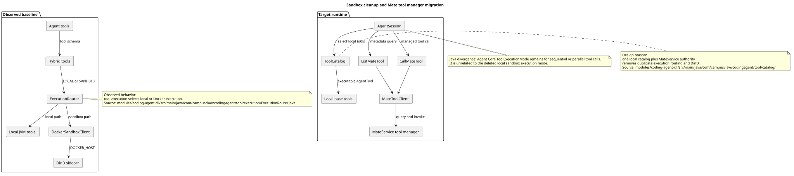

# pi-mono-java Sandbox 清理与工具管理器迁移

> 历史迁移记录。当前规范已由
> [CampusClaw 受管 Agent 工具系统 v2](tool-system-v2.md)取代；本文提到的本地
> `ToolCatalog`、CLI 双入口和旧 Mate 工具名称不再是当前实现。本文曾保留的
> 单容器 Docker/Kubernetes 过渡资产也已由
> [临时 Docker 与 Kubernetes 资产清理](deployment-assets-cleanup.md)取代。

## 文档信息

| 项目 | 内容 |
|---|---|
| 文档版本 | v1.2 |
| 历史分析源码基线 | `origin/main@7811dc335fcb0125a1ecbddd63cd77baf120f21d` |
| 后续部署资产清理基线 | `origin/main@dee709fc584dd722d2e94eb381338b997659e35a` |
| 适用模块 | `modules/coding-agent-cli`、`modules/agent-core`、`mate-campusclaw` |
| 变更类型 | 架构迁移、部署简化、过期文档清理 |

## 1. 结论与原因

本次清理将本地 Docker Sandbox、Hybrid Tool 和 Skill Sandbox Parser 完全移除。未来工具元数据和受管控的远程工具执行由 MateService 工具管理器负责；CampusClaw 本地只保留普通基础工具和本地 `ToolCatalog`。

该基线已经包含 `ToolCatalog`、`MateToolClient`、`ListMateTool` 和 `CallMateTool`。继续保留本地 Docker 路由会同时维护两套工具执行权威，造成配置、部署、Schema 和安全语义分裂，因此这是架构变化，不是简单的代码删减。

本次变更不宣称本地 JVM 工具是安全沙箱。普通本地工具继续使用现有路径校验、超时、进程树清理和输出截断；需要集中授权、查询或执行的工具走 MateService。

## 2. 源码证据

以下证据均来自上述基线，行号以该提交文件为准：

| 观察到的行为 | 源码证据 |
|---|---|
| `tool.execution` 集中配置本地/沙箱/Hybrid 路由、Docker 地址、资源和超时 | `modules/coding-agent-cli/src/main/java/com/campusclaw/codingagent/config/ToolExecutionProperties.java:28`，`ToolExecutionProperties` |
| 默认服务和 CLI 两个 Spring 入口都注册沙箱配置 | `modules/coding-agent-cli/src/main/java/com/campusclaw/codingagent/CampusClawApplication.java:23`、`CampusClawCliConfiguration.java:28` |
| `ExecutionRouter` 在本地工具与 Docker 客户端之间路由 | `modules/coding-agent-cli/src/main/java/com/campusclaw/codingagent/tool/execution/ExecutionRouter.java:41`，`ExecutionRouter` |
| Skill Loader/Expander 支持 Docker 沙箱解析 | `modules/coding-agent-cli/src/main/java/com/campusclaw/codingagent/skill/SkillLoader.java:30`、`SkillExpander.java:21` |
| 本地工具由 `ToolCatalog` 索引，Mate 工具由客户端和两个 AgentTool 暴露 | `modules/coding-agent-cli/src/main/java/com/campusclaw/codingagent/tool/catalog/ToolCatalog.java:23`、`common/client/mate/MateToolClient.java:19`、`tool/mate/ListMateTool.java:35`、`CallMateTool.java:37` |
| Agent Core 的 `ToolExecutionMode` 表达串行/并行工具调用 | `modules/agent-core/src/main/java/com/campusclaw/agent/tool/ToolExecutionMode.java:13` |
| K8s 使用 Docker 等待、DinD sidecar 和特权容器 | `modules/k8s/deployment.yaml:109`，`sandbox` 容器 |
| MateService 负责工具元数据与调用客户端 | `docs/designs/mate-tool-client.md`、`modules/coding-agent-cli/src/main/java/com/campusclaw/codingagent/tool/mate/` |

上述内容是现状证据。下面的删除清单和单容器部署是本次目标设计，不表示它们已经存在于基线中。

## 3. 目标架构

PlantUML 源码：[diagram.puml#L1](sandbox-cleanup/diagram.puml#L1)

目标运行时关系如下：

- `CampusClawCommand` 和 `AgentSession` 使用本地 `ToolCatalog` 获取普通基础工具。
- `ListMateTool` 查询 MateService 管理的工具元数据。
- `CallMateTool` 通过 `MateToolClient` 将工具调用转交 MateService。
- Agent Core 的 `ToolExecutionMode` 仍用于工具调用的串行/并行调度，与已删除的本地 `tool.execution` 路由无关。

## 4. 设计决策

本次架构迁移的正式决策记录见 [ADR-0015：移除本地沙箱并统一由工具管理器管理受管控工具](../decisions/0015-sandbox-cleanup-tool-manager.html)。该 ADR 记录备选方案、选择理由和对开发/运维的影响。

## 5. 删除与保留矩阵

| 类别 | 删除 | 保留或替代 |
|---|---|---|
| 本地执行路由 | `ExecutionMode`、`ExecutionRouter`、`ToolExecutionStrategy` | Agent Core `ToolExecutionMode` |
| Docker Sandbox | `DockerSandboxClient`、`SandboxResult`、`ResourceLimits`、`SandboxSecurityPolicy` | 本地基础工具的既有校验和超时能力 |
| Hybrid Tool | 六个 `Hybrid*Tool` 及测试 | `BashTool`、`ReadTool`、`WriteTool`、`EditTool`、`GlobTool`、`GrepTool` |
| Skill 沙箱解析 | `SandboxSkillParser`、`SKILL_SANDBOX_PARSING` 调用链 | 本地 `SkillLoader`、`SkillExpander`、`SkillManager` |
| 配置 | `ToolExecutionProperties`、`tool.execution.*`、`TOOL_EXECUTION_*`、`DOCKER_HOST` | Mate 工具配置和普通应用配置 |
| 工具管理 | 不删除 Mate 工具客户端 | `ToolCatalog`、`ListMateTool`、`CallMateTool` |
| 调度部署 | DinD sidecar、Docker readiness、`privileged`、Docker 存储卷 | 一个 CampusClaw/MateService 应用容器 |

删除后，旧环境变量不再被读取，也不提供兼容别名。部署配置应主动移除它们；不存在数据库表、持久化记录或数据库迁移。

最新主干新增的 Runtime V1 SSE 事件名 `tool.execution.started` 和
`tool.execution.completed` 表示 Agent 工具执行生命周期，不属于上述
`tool.execution.*` Sandbox 配置。两项事件契约继续保留，这是与旧配置同名前缀但语义独立的架构边界。

## 6. 文件与文档清理记录

### 6.1 删除的源码、测试和脚本

- 两套 `tool/sandbox`、`tool/hybrid`、本地执行路由源码和测试。
- 两套 `SandboxQuickTest`、`ToolExecutionPropertiesTest`。
- `run-with-sandbox.sh`、`run-with-sandbox.bat`、`test-sandbox*.sh`、`verify-sandbox.sh`、`test-persistent-container.sh`。
- `modules/k8s` 下三份沙箱 Dockerfile 和四份沙箱 Compose 文件。

### 6.2 删除的过期文档

- `ARCHITECTURE-HYBRID.md`
- `IMPLEMENTATION-HYBRID.md`
- `DOCKER-SANDBOX-GUIDE.md`
- `DOCKER-SANDBOX-SETUP.md`
- `ARCHITECTURE-SUMMARY.md`

这些文档描述已经移除或不存在的类、旧 Gradle 构建方式、Docker 参数和个人机器路径，不建立归档目录；本节就是删除记录。

### 6.3 更新的维护文档

- `docs/designs/coding-agent-cli.md`：改为本地基础工具、`ToolCatalog` 和 Mate 工具调用说明。
- `docs/designs/agent-skill-runtime.md`：删除沙箱解析映射，保留本地 Skill 快照和 ToolCatalog 目标。
- `docs/designs/control-plane.md`：删除 Docker Sandbox 能力枚举。
- `docs/designs/cron.md`：删除对 Hybrid Bash 的依赖描述。
- `CLAUDE.md`：删除沙箱配置、脚本和过期文档索引。
- `modules/k8s/README.md`：改为单容器部署说明。

### 6.4 后续删除的过渡部署资产

在 `origin/main@dee709fc584dd722d2e94eb381338b997659e35a` 基线上，仓库不再承担
Docker 镜像和 Kubernetes 部署框架维护职责，因此删除：

- 根 `Dockerfile` 和 `k8s/mateservice-deployment.yaml`；
- `modules/k8s/` 全目录；
- `modules/coding-agent-cli/src/main/resources/application-k8s.yml`。

这次后续删除是架构变化，不表示 Docker 或 Kubernetes 永久不受支持。未来 Kubernetes
框架是 target-only 后续设计，不能把本节删除前的镜像名、资源名、存储和探针配置当成新框架基线。

## 7. 后续部署与运维边界

- 本文 v1.0/v1.1 曾把单容器 Docker/Kubernetes 清单作为移除 DinD 后的过渡目标；该目标不再是当前仓库能力。
- 当前仓库只维护 Maven/JAR 构建入口，不维护 Dockerfile、Kubernetes 资源或 Kubernetes 专用 Spring Profile。
- 未来 Kubernetes 框架必须独立确定镜像供应链、配置、秘密、探针、存储、网络和发布验证；当前没有对应实现。
- 外部遗留容器、镜像、Kubernetes 对象和 volume 的清理由发布运维按环境确认后执行，源码变更不自动删除它们。
- 如果需要回滚本地 Docker Sandbox，必须回到包含旧沙箱代码的完整版本，并同时恢复配置、Docker daemon、sidecar 和权限设置；不能只恢复一个旧类文件。

## 8. 验收记录

v1.0/v1.1 的历史验收标准包括：

- `modules/coding-agent-cli` 和 `mate-campusclaw` 均可编译测试。
- 本地基础工具仍由 Spring 和 `ToolCatalog` 注册，Schema 不包含 `_executionMode`。
- `ToolExecutionMode` 的串行/并行行为保持不变。
- 生产源码、测试、配置和部署文件不再引用 `ExecutionRouter`、`Hybrid*`、`DockerSandbox`、`SandboxSkillParser`、`ToolExecutionProperties`、`TOOL_EXECUTION_*`、`DOCKER_HOST`、DinD 或 `privileged`。
- `application*.yml` 不再存在 `tool.execution.*` 配置；仅 Runtime V1 的 `tool.execution.started/completed` SSE 事件名被明确保留。
- `kubectl kustomize modules/k8s` 成功，Deployment 只有一个应用容器。
- PlantUML 能生成 SVG；SVG 是有效 XML；Markdown 引用、源码链接和行号锚点有效；`git diff --check` 通过。

v1.2 后续清理改为验证：

- 仓库中不再存在根 Dockerfile、Kubernetes 清单或 `application-k8s.yml`；
- README 和维护文档不再把这些文件描述为当前部署能力；
- Maven/JAR 构建和 `mate-campusclaw` 镜像同步检查通过；
- 本文和 ADR-0015 链接到后续清理设计与 ADR-0033。

## 9. 版本历史

| 版本 | 日期 | 说明 |
|---|---|---|
| v1.2 | 2026-08-28 | 记录单容器 Docker/Kubernetes 过渡资产的后续删除，并把未来 Kubernetes 框架划为独立设计 |
| v1.1 | 2026-08-19 | 合入 `origin/main@7811dc33` 的 HTTP V1、CLI 启动和 Agent 委派变更，并区分 Runtime SSE 事件名与已删除 Sandbox 配置 |
| v1.0 | 2026-08-19 | 记录本地沙箱清理、MateService 工具迁移、单容器部署和过期文档删除 |
