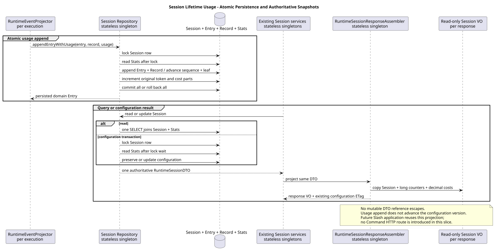

# Session lifetimeUsage：原子累计与资源复用

版本：1.0.0 · 日期：2026-09-07 · R07 已实现代码对齐切片。

## 1. Context 与范围

已确认 Session 资源包含生命周期 Usage，旧实现仅保存 cached/uncached/total 与总费用，
不能恢复 input/output/cacheRead/cacheWrite 或费用分项。本切片补齐原始分项的原子累计、
权威 Session DTO 与既有响应组装，供后续 Slash 复用；不新增 Command HTTP 路由。
创建 Session 返回全零 Usage；GET Session 与既有 PUT Model/Thinking 使用同一只读 Usage VO。

设计仓固定只读基线为 `88f4df16bc24bbfcd28e1ec374feb2de0db8be3b`：
`04-命令与技能/01-内置命令/README.md` §8、§8.1（Builtin 2.9.0）；
`01-总体架构/01-CampusClaw多Agent运行时/接口契约/操作/01-create-session.json`、
`02-get-session.json`、`07-change-session-model.json`、`08-change-session-thinking.json`。
不修改设计仓，不扩展 Events V2、旧控制接口退役或前端迁移。

## 2. 关键定义与源码证据

Java 变更前基线：`6f52fddc87a03c20916fc7b6ef1de87f6a7a8cf5`。
以下 Java 路径均以 `modules/coding-agent-cli/src/main/java/com/campusclaw/codingagent/` 为前缀。
本次以既有 Java Session API 为主基线，不重新定义 pi 或其他 Harness 的行为。

| 相对路径与符号 | 观察到的基线行为 | 本次目标决策与理由 |
|---|---|---|
| `runtimeapi/event/RuntimeEntryCodec.java:usageRecord` | 内部 Record 已保存完整 Usage 及来源 | 直接累计同次调用传入的原始 Usage，不反推旧指标 |
| `runtimeapi/event/RuntimeEventProjector.java:persistAssistant/projectCompactionCompleted` | Assistant 与 Compaction 共用 appendEntryWithUsage | 两类来源都计入生命周期，不改变公开事件投影 |
| `runtimeapi/persistence/MyBatisRuntimeSessionRepository.java:appendEntryWithUsage/accumulateUsageStats` | 主行锁后，Entry、Record、序号、叶节点及粗粒度 Stats 同事务 | 原事务增加真实分项，保留失败整体回滚（架构补齐） |
| `runtimeapi/mapper/RuntimeSessionMapper.java`；`modules/coding-agent-cli/src/main/resources/mapper/session/RuntimeSessionMapper.xml:findSession/lockSessionForUpdate` | Session 读取尚不含统计 | GET 单条联表查询；写操作先锁 Session、再读 Stats，防止等待锁后返回旧 Usage |
| `runtimeapi/session/RuntimeSessionResponseAssembler.java:createView/getView` | VO 与 ETag 来自一个 DTO，但 VO 缺 Usage | 增加只读业务 Usage/Cost VO，禁止 DTO 深层泄漏（契约补齐） |
| `modules/coding-agent-cli/src/main/resources/db/gaussdb/install/session_schema.sql:t_session_stats` | BIGINT 与 NUMERIC(24,8) 粗粒度累计 | 新增四个 Token 分项和四个费用分项；总数保留上游值，不强制重算分项和 |

完整资源复用、无公开 command/changed/sourceEventSeq 是已确认的产品约束；本次新增读取与存储分项是架构补齐。
旧 cached_tokens=cacheRead、uncached_tokens=input+cacheWrite 继续维护，仅供既有内部指标，绝不反推公开分项。
数据库只维护首版全量安装 SQL，不新增升级或回填脚本；部署不得将安装脚本用于保留旧数据的环境。

## 3. 架构与数据流

[PlantUML 源码](session-lifetime-usage/diagram.puml#L1)

`RuntimeLifetimeUsageDTO` 是纯数据载体：累计计数用 long，费用用 BigDecimal。
Repository 将单次 AI Usage/Cost 转为 Mapper DTO；缺失 Usage/Cost 沿用零值语义。
不在 DTO 中加入校验、持久化或组装方法；公开 `LifetimeUsageResponseVO` 嵌套的费用对象仍为只读 VO。
资源与 ETag 从同一个 RuntimeSessionDTO 组装，VO 复制数值后不保留可变 DTO 引用。

GET 的一条 SELECT 同时读取 Session 与 Stats，使用同一数据库查询快照，不刷新 Agent、不调用模型。
写事务的 `lockSession` 先执行原有 SELECT FOR UPDATE，再读取 Stats；所有累计写也先取得相同主行锁。
因此等待并发写提交后，配置修改与同值结果携带新统计，而不是锁等待前的联表快照。
配置事务没有提交后的额外 GET；现有 PUT 的 If-Match、资源版本、updatedAt 与事件语义保持不变。
仅 Usage 追加不升配置 resourceVersion、不改 updatedAt；ETag 不增加实时 Usage 缓存版本承诺。

## 4. 设计决策、边界与 DFX

见 [ADR-0061](../decisions/0061-persist-session-lifetime-usage.html)。

- Stats 每 Session 一行；写入固定十个分项/总量，GET 固定主键联表，不扫描历史，空间和查询开销 O(1)。
- 更新类操作增加一次锁内 Stats 读取，短事务持锁；不做文件、远程或模型访问，不改变主行优先的锁顺序。
- 单次 Usage 的 int 先扩为 long，再交给 BIGINT 累计；保留超过 32 位的生命周期计数。
- 费用保持既有 NUMERIC(24,8) 存储精度。BigDecimal.valueOf 保留上游 double 的十进制表示；不声称恢复上游未提供的精度。
- 数据库非负约束、唯一键或任一步骤失败回滚 Entry、Record、序号、叶节点及全部 Stats；无部分累计结果。
- 不新增表、线程、Maven 依赖、自动恢复任务或敏感信息存储；内部 Usage Record 不变为公开事件。
- Compact 的独立 Handler/Command Application/HTTP 仍未实现；本切片不宣布共享入口已发布。

## 5. 测试与验证

- 新增数据库测试覆盖全零精确字段、Assistant/Compaction 原始分项、上游总数不等于分项和、超过 int 的累计、
  缺失 Usage/Cost、唯一键与统计约束失败整体回滚、并发累计、锁等待后的同值 Model 完整快照及独立 JVM 恢复。
- 新增资源组装测试验证创建零值、全部分项、只读拷贝与 ETag 同源；既有 GET/PUT、Model/Thinking、Repository、Compact 准入回归。
- JDK 21 下 `./mvnw -q spotless:apply checkstyle:check verify` 通过：1658 项常规测试，0 失败/错误/跳过。
- 专用真实 openGauss 通过 10 项新增 Usage 测试、24 项既有 Repository 测试和 11 项 Compact 准入测试；
  独立 JVM 测试真实重新创建 Spring/MyBatis 上下文并比较完整 Session JSON。
- 新增两份测试文件使用本机归档 quality checker 检查，0 errors、0 warnings；规范指定的 `.claude` 路径不存在。
- 所有本次修改的模块 Java 文件通过 AST 方法/构造器 50 行、版权和 DTO/VO 布局检查；新 public 类型文档检查通过。
- PlantUML 生成、ASCII、SVG XML、Markdown SVG/源码行锚点及 diff 检查通过；ADR 已检查 1280px/360px 渲染与本地链接。
- 默认 sync 无法解析公司 NativeParent；显式 `--no-verify` 完成源码同步和 dry-run 一致性检查，**公司镜像编译未验证**。
- 本次模块新增 776 行，含镜像总新增 1552 行；不新增 Maven 依赖，低于模块 850/总量 1800 软上限和 2000 硬限制。

## 6. 后续依赖与版本历史

R06 同时修复 Status/Name/Model/Thinking 的完整 Session 结果通道；两条分支独立从 main 开发，不互相堆叠。
按用户 2026-09-07 最新授权并行开发、独立复审、串行合并；后合入分支先合并最新 main 并执行交叉文件回归。
后续应用层复用 Session/Models 业务 VO，仅为 Help、Compact、Skills 引入最小业务结果；内部回执不公开。

| 版本 | 日期 | 变更 |
|---|---|---|
| 1.0.0 | 2026-09-07 | 补齐 Session 原始 Usage 分项与同源资源投影，保留原事务和配置版本语义。 |
