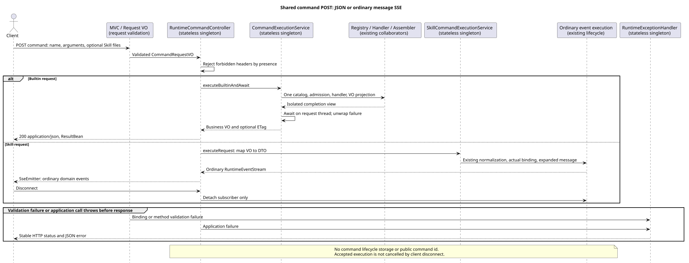

# 共享命令 POST 接入

版本：1.0.1 · 2026-09-08。

## Context 与范围

在请求解析和真实 Skill 执行均已合入后，发布
`POST /campusclaw-service/v1/sessions/{sessionId}/command`。
同一入口接通七个 Builtin 的普通业务 JSON 与 Skill 的普通消息 SSE，不提供占位执行。
已发布 GET、普通 Events、既有 PUT 条件更新和控制接口不迁移；真实 JAR/openGauss 跨进程验收另行串行交付。

契约依据为只读设计仓 `88f4df16bc24bbfcd28e1ec374feb2de0db8be3b`：
`04-命令与技能/{00-Slash-Command通用模块,01-内置命令,02-技能命令}/README.md`，以及
Runtime `接口契约/操作/13-execute-session-command.json`。
用户2026-09-08确认的共享请求和 Skill 展开文本公开/保存方案补充旧待评审标记，见已合入
[请求解析](../command-request-contract/README.md)和[Skill 实际执行](../skill-command-execution/README.md)。
本片不修改独立设计仓、不另立字段规范、不增加 Maven 依赖。

## 源码证据与关键定义

Java 分析基线：`2f52e9b80c95c5c27141362976b918227b1c5d60`。
本片实现证据：`1f0cb7ece4c5228b5d14f89c8072bb528443378f`，含共享入口、应用适配、错误处理与测试。
下列路径根为 `modules/coding-agent-cli/src/main/java/com/campusclaw/codingagent/`。

| 分类 | 路径与符号 | 观察与本片理由 |
| --- | --- | --- |
| 已有 | `runtimeapi/vo/CommandRequestVO.java`、`runtimeapi/web/json/CommandRequestDeserializer.java#deserialize` | 按命名空间绑定封闭联合 VO；字段类型、未知字段和 Jakarta 约束已有，不复制解析器。 |
| 已有 | `runtimeapi/service/command/CommandExecutionService.java#executeBuiltin` | 一次 Builtin Catalog、Definition/Handler 分派、业务 VO/ETag 投影和隔离完成视图已有，只补请求线程等待。 |
| 已有 | `runtimeapi/service/command/skill/SkillCommandExecutionService.java#execute` | DTO 归一、同次实际绑定与正文展开、普通消息执行已有，只补 VO→DTO 映射。 |
| 已有 | `runtimeapi/web/RuntimeEventController.java#submit`、`RuntimeSseEmitterSubscriber.java` | 普通 SSE 的订阅与 detach-only 回调已有，共享 POST 复用。 |
| 已有 | `runtimeapi/web/RuntimeExceptionHandler.java#handleInvalidBody/#handleInvalidParameter` | 原错误分类没有 Command；方法校验只识别路径，异常 cause 可带被拒绝值。 |
| 本片新增 | `runtimeapi/web/RuntimeCommandController.java#execute` | 只按请求 VO 类别选择业务 JSON 或 SSE，不按七个名称分派。 |
| 本片新增 | `CommandExecutionService.java#executeBuiltinAndAwait`、`skill/SkillCommandExecutionService.java#executeRequest`（均在上述 service/command 下） | 等待及异常解包、薄 VO 适配；默认值和业务校验仍归原 Service。 |
| 本片修改 | `runtimeapi/web/RuntimeExceptionHandler.java#isCommandExecutionRequest/#hasInvalidCommandBody` | 依据实际匹配 Controller，局部投影命令错误 JSON、校验错误和无 cause 日志，不改变 GET 的503规则。 |
| 上游观察 | pi `4af9d21d3b4d664e4a29fcabfec85171077248e3`，`packages/coding-agent/src/core/agent-session.ts#_tryExecuteExtensionCommand/#_expandSkillCommand`（1289/1320行起） | 本地按名称调用 Handler，Skill 展开本地正文并在未知时回退；没有 Java HTTP 联合响应。 |

结构化入口、业务资源结果及 Skill 正文公开是已确认产品约束；复用服务与普通消息流是架构选择；
拒绝未知命令回退、禁止 Header、无敏感异常正文是安全加固，不能称为 pi 已有 HTTP 行为。

## 架构与生命周期

[PlantUML 源码](diagram.puml#L1)

Controller、Service 和集中异常处理器均为无请求状态的 Spring 单例。
请求 VO、Locale、MateCredentials、完成视图和 SseEmitter 仅属于本次调用。
Controller 不接触 Repository、Registry、Holder 或内部 DTO；只将 Service 返回的业务 VO 交给 ResultBeanAdapter。

Builtin 的 `executeBuiltinAndAwait` 在已有虚拟请求线程中等待隔离句柄，解开 CompletionException，
不把 Future 作为 MVC 异步结果，也不创建线程池。客户端断开不会通过此观察句柄取消已接受 Compact。
具体命令仍由 Registry/Definition/Handler 决定，结果类型分派仍只在响应组装器中。

Skill 的 `executeRequest` 只去命名空间并映射字段；默认值、空白输入、重复附件和长度仍走唯一 `execute` 路径。
同次已绑定 Skill 正文与输入按原服务展开后作为普通消息执行/保存/公开；name-only 也调用真实执行服务。
SSE 的 completion/timeout/error 只解除订阅，不取消已经接受的执行；流开始后的失败沿原终态协议处理。

Mate 四项 Header 经 RuntimeRequestContext 原样读取，不做本地认证、互斥或完整性校验。
Builtin 普通处理结束后不继续持有；Compact 和 Skill 沿既有本次执行对象持有至执行结束。
仅实际 Mate tool execute 请求可携带，模型、发现请求、Prompt、日志和数据库不新增这些值。
缺少工具执行所需值的处理仍由原 Mate 调用服务承担，不在 Command Controller 新增认证协议。

## 设计决策与边界情况

[ADR-0074](../../decisions/0074-shared-command-http.html)记录框架返回类型及错误边界的选择。

- Controller 声明 `Object`，实际返回 ResultBean 或 SseEmitter。Spring 6.2.6 对
  `ResponseEntity<?>`/`ResponseEntity<Object>` 的声明无法选择 SSE 处理器；临时确定性实验已复现。
  采用框架既有动态返回处理，不引入自定义返回值处理器或 JSON emitter。
- `If-Match`、`Idempotency-Key` 只要存在就拒绝，包括空值；不根据 Accept 决定执行类别。
  客户端应接受 JSON 和 SSE，并根据实际 Content-Type 处理；不自动重放结果不确定的 POST。
- Builtin 成功仅包装业务 VO，按已有 Session 视图选择 ETag；Help/Models 查询/Compact/Skills 不增加 ETag。
  不公开内部 `RuntimeSessionView`、DTO、command、changed、sourceEventSeq 或命令生命周期。
- 成功 no-store、实际 Content-Language；命令错误也显式 JSON/no-store，即使请求只 Accept SSE。
  JSON 绑定错误和请求体 Jakarta 错误为 INVALID_COMMAND_REQUEST；同时存在路径错误时保留 INVALID_SESSION_ID。
  方法返回值校验不伪装成请求错误。未预期命令异常为 COMMAND_EXECUTION_FAILED。
- 命令校验和意外错误日志只保留结构化操作信息、稳定码及请求路径，不附带原异常 cause、VO 或 rejectedValue。
  原 GET Catalog 的 AGENT_NOT_AVAILABLE 仍为503/Retry-After 3，其他操作原行为保留。

## 性能与验证边界

不新增表、升级脚本、队列、定时器、线程池、模型调用次数或消息副本存储。
Builtin 的等待时长由实际 Handler 及原 Runtime 超时管理；Skill 流继续使用现有有界缓存与 dispatcher。

正式 MVC 测试覆盖真实路由、七 Contributor/应用/投影的 JSON，Skill 真实适配与展开、普通流连接，
以及字段/ETag、Header拒绝、name-only、Future等待与解包、方法校验、SSE-only错误JSON和日志canary。
窄业务服务、Repository、模型与外部执行由测试替代；不据此宣称真实数据库、文件加载、完整工具组装、
网络断线或跨JVM恢复已验证。已有 GET、Events、PUT 的正式回归保留。
在上述实现提交执行 `./mvnw -q spotless:apply checkstyle:check` 与 `./mvnw -q clean verify`：
397个测试类、2028项普通测试，0失败/错误/跳过。其中新增正式案例77项：共享成功MVC27、
错误MVC41、Builtin等待/解包2、Skill适配7；均已包含于总数，不重复累加。
全量构建包含既有清单GET19、Events路由5及Model/Thinking PUT路由6项回归。
临时框架实验不计入正式测试数；本片未运行真实JAR/openGauss集成测试。

四个新增/修改测试文件的质量脚本为0错误/警告。配置的解包目录不存在，实际执行同一已安装
`java-ut-coverage-loop.skill` 归档中的 `scripts/check_test_quality.py`，不以替代检查冒充原脚本。
Java AST检查16个源文件及镜像的方法/构造器均不超50非空行；既有空记录
`UnsupportedResultDTO` 的布局不能由脚本验证，已人工确认仅为未知结果类型测试，没有字段或业务逻辑。

正常镜像同步在解析公司 `NativeParent:26.0.0-SNAPSHOT` 时失败，公司编译仍未验证。
按普通本地环境流程显式 `scripts/sync-campusclaw.sh --no-verify` 同步后，布局检查、
dry-run内容差异检查和8对源码的包名转换后逐字节比对通过。
`bash scripts/check-commit-additions.sh origin/main HEAD` 为1692/2000行，其中模块846行，低于850预算。
实现说明、ADR-0074、模块架构和实施状态同步；PlantUML重生成一致、SVG XML、ASCII、
链接/行锚点、1280/360宽度ADR渲染及 `git diff --check` 已验证。

### 主线同步

正常合并提交 `5d490f4c168b618244d9829aa776eaa1ad2ef499` 的父提交分别为本片原head
`d26f7ab2d97f32c283b32f14cb050a9addf81558` 和主线
`fd556dce3cfa12e5e834b6e9b8f835f10e7d67c8`，没有代码冲突或额外合并修正。
主线的 `runtimeapi/event/RuntimeEventService.java#prepareAndSubmitLocked` 在实际展开消息接受后先排入回执，
`RuntimeExecutionCoordinator.java#handleAcceptedStartFailure` 负责接受后的启动失败收尾。
共享 Skill 原样复用此行为：消息接受前的异常可返回错误 JSON；接受后的失败保留普通 SSE，
即使此时 HTTP 尚未开始写出，也不把已接受消息重新解释成接收失败。
此处记录主线观察和集成验证，不在本片扩展 Events v2 实施；详见主线
[已接受事件失败处理](../runtime-event-acceptance/README.md)。主线已占用0073，本片ADR改用0074。

合并后的 `./mvnw -q spotless:apply checkstyle:check` 与 `./mvnw -q clean verify` 再次通过：
397类、2032项普通测试，0失败/错误/跳过。包括共享成功/错误MVC27/41、Builtin/Skill应用43/32、
RuntimeEventService8、RuntimeEventOutput8（含协调器失败收尾）、GET清单19、Events路由5和PUT配置路由6。
这些是同一全量报告中的分类，不额外相加；本片代码与新增77项用例不变。
相对新主线的门禁仍为1692/2000，未将 #251 主线新增代码计入本PR，也没有豁免合并独有修改。

## 版本历史

| 版本 | 日期 | 变更 |
| --- | --- | --- |
| 1.0.1 | 2026-09-08 | 正常合入fd556dce的事件接受后失败修复并重跑组合回归；ADR改用未占用的0074。 |
| 1.0.0 | 2026-09-08 | 从已合入请求/执行能力接通共享 POST，保留后续独立跨进程验收。 |
