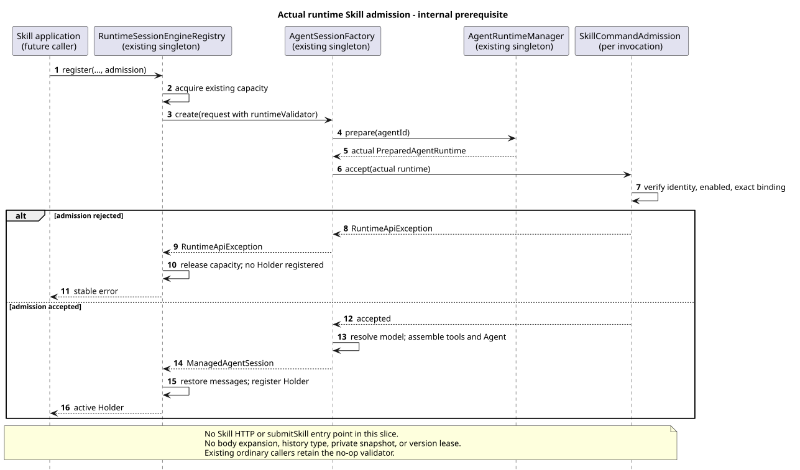

# 实际运行快照上的 Skill 准入

版本：1.0.0 · 日期：2026-09-07 · 范围：内部前置能力，未发布 Skill 执行入口或 HTTP 路由。

## Context

显式 Skill 调用需要核对严格名称和当前执行所用 Agent 的直接绑定。已有发现清单只是展示投影，
不能替代实际执行的准入。本片只把现有公共 Session 工厂的准入接点贯通到 Runtime 注册表，
并提供无共享请求状态的 Skill 策略；没有新增通用命令框架。

实现起点为 `pi-mono-java@b7f077d59b09362dc366241920a85b6d218d1189`。
本片代码提交为 `a143a00798a319e1404f393e4b50fea02de53eb2`；新增策略与 Registry 重载
均以此提交为证据，不归入起始基线的已观察行为。
不依赖未合入的 PR #241。设计仓以只读方式核对
`88f4df16bc24bbfcd28e1ec374feb2de0db8be3b` 的
`04-命令与技能/02-技能命令/README.md`（3.2.0，§3–4）与
`04-命令与技能/00-Slash-Command通用模块/README.md`（1.6.0，§3–4）。
没有修改设计仓文件。

## 关键定义与源码证据

下表 Java 路径相对实现仓，源码根为
`modules/coding-agent-cli/src/main/java/com/campusclaw/codingagent/`。

| 分类 | 路径、符号 | 观察或决定与原因 |
|---|---|---|
| 已观察 Java 基线 | `session/AgentSessionFactory.java:create` | `prepare` 后立即调用请求的 `runtimeValidator`，然后检查启用、解析模型、组装工具与 Agent；可复用此接点。 |
| 已观察 Java 基线 | `session/ManagedAgentSessionRequest.java` | 已有 `Consumer<PreparedAgentRuntime>`；null 在请求构造时归一为空操作，不需要新 SPI。 |
| 已观察 Java 基线 | `runtimeapi/runtime/RuntimeSessionEngineRegistry.java:register/createSession` | 容量先获取；构造失败释放容量；Runtime 原本传 null validator。 |
| 已观察 Java 基线 | `runtime/PreparedAgentRuntime.java:findSkill`；`runtime/AgentRuntimeManager.java:loadSnapshot/loadSkill` | 完整快照保存已校验的绑定 Skill；显式准入可直接精确匹配，不再次读文件或刷新管理器。 |
| 已确认产品规则 | `modules/common/src/main/java/com/campusclaw/common/constant/ClawConstants.java:Skill.isValidName` | 加载、发现与显式调用共享 1–64 字符及严格名称规则；不新增 Command 专属正则。 |
| 本片 Java 架构变更，`a143a007` | `runtimeapi/command/skill/SkillCommandAdmission.java`；`runtimeapi/runtime/RuntimeSessionEngineRegistry.java:register` 的 validator 重载 | 本次调用对象持有目标 Agent ID 与无前缀 Skill 名称；核对实际快照的身份、启用和精确直接绑定。 |
| 上游观察 | pi `4af9d21d3b4d664e4a29fcabfec85171077248e3`，`packages/coding-agent/src/core/agent-session.ts:_expandSkillCommand` | pi 展开本地 Skill 正文，未知 Skill 或读取失败时回退原文；Java 显式未绑定名称拒绝，不照搬本地 fallback（产品约束与安全加固）。 |

`PreparedAgentRuntime` 是当前创建 Agent 的完整快照，不是 Session 全生命周期版本租约。
本片不增加热刷新、版本固定、失效协调或私有快照系统。测试中替换工厂输入只验证准入接点
确实消费本次对象，不把热更新当作当前产品使用模式。

## 架构与数据流

[PlantUML 源码](diagram.puml#L1)

1. 调用方在自己的应用边界解析 `skill:` 前缀；本片接收无前缀名称，构造 `SkillCommandAdmission`。
2. 后续 Skill 执行应用在既有 Session 操作锁内，向 Registry 的重载传入该策略。
3. Registry 获取既有运行容量，将策略透传到现有 `ManagedAgentSessionRequest.runtimeValidator`。
4. 公共工厂准备实际 Agent 快照，然后检查目标身份、启用和直接绑定，成功后才组装工具与 Agent。
5. 准入失败原样传播稳定 `RuntimeApiException`，Registry 释放容量，不登记 Holder。
6. 原七参数 `register` 继续传 null；普通 Events、Compact 等原调用方不受 Skill 策略影响。

策略不是 Spring Bean，也不保存 Manager、文件、正文、请求凭据或执行句柄。
只持有不可变的两项身份；没有中央命令名称分派、伪 Handler 或新数据表。

## 设计决策

[ADR-0067](../../decisions/0067-actual-runtime-skill-admission.html) 记录复用实际工厂接点的原因，
以及不扩展正文、公开历史和 HTTP 的交付边界。

## 边界情况

| 条件 | 内部结果 |
|---|---|
| 名称为 null、空、65 字符、前导 Slash、命名空间前缀或违反共享严格规则 | `INVALID_COMMAND_REQUEST` |
| 实际快照缺失、元数据缺失、Agent 身份不一致或禁用 | `AGENT_NOT_AVAILABLE` |
| 实际快照未直接绑定精确名称 | `COMMAND_NOT_FOUND`，不回退为普通文本 |
| 名称合法且精确直接绑定 | 返回实际快照里的同一个 `SkillInfo` 对象；`accept` 只完成检查 |
| 工厂准入失败 | 不组装工具、不登记 Holder，容量可用于下一次登记 |
| 普通 Events 的 Agent 未绑定 Skill | 原登记语义不变，不强制 Skill 准入 |

以上是内部错误，不在本片新增 HTTP 映射或承诺完整 Skill POST 契约。

## 性能与 DFX

新增检查仅扫描本次快照中的直接绑定，时间复杂度 O(n)，不新增 I/O、线程、锁或容量池。
`RuntimeEventService` 的操作锁、Repository 事务、事件投影和超时均保持原状。
本片不写日志；错误不携带正文、路径、凭据或底层异常原因。

## 契约与后续边界

用户已确认 Skill 使用普通消息 SSE；Builtin 普通 JSON 不变。本片不增加 `submitSkill`，
不把仅原始参数的普通执行声称为 Skill 执行，也不发布 Commands 路由。

实际源代码还证明：`runtimeapi/event/RuntimeEntryCodec.java:userEntry/toUserMessage/toAgentMessages/appendUserPayload`
用同一普通 `message` 承载执行、恢复、SSE 与 GET 事件内容。因此，把展开正文保存为普通消息会让
正文进入普通公开历史；只展开执行用 `UserMessage`、却保存另一份 `message`，则导致执行和恢复输入不一致。
这不涉及既有每轮 System Prompt 装配，本片也不定义 System Prompt 与 Skill 正文的组合策略。
正文呈现策略需要精确确认，不能仅由“SSE”推导出来，本片不替用户决定。
Skill 设计 §4 明确额外私有 Skill 版本/正文快照不作为当前要求；本片不创建此类扩展。

后续完整入口应复用普通 Events 的执行、持久化、恢复及资源清理；如在 Holder 注册后构造消息失败，
必须回收该 Holder 与容量。这是后续验收要求，本片没有新增该失败窗口。
通用 Events V2、额外历史类型、升级 SQL 与设计仓修改均不在范围内。

## 测试与验证

- `SkillCommandAdmissionTest`：17 个执行用例，覆盖共享名称样例、64/65 边界、身份、启用和精确绑定。
- `RuntimeSkillAdmissionTest`：3 个用例使用真实 `AgentSessionFactory`、Registry、Agent，
  以受控 Manager 返回实际快照，验证无绑定失败、建模前拒绝、容量回收、每次准入和普通登记不变。
- 原 `RuntimeEventServiceTest` 6 个、`RuntimeSessionEngineRegistryTest` 2 个回归通过，包含普通 Slash 原样处理。
- 交付前执行完整相关模块测试、Spotless/Checkstyle、测试质量脚本、Java AST 方法长度检查、
  镜像同步、PlantUML/SVG/HTML 校验、渲染检查、`git diff --check` 与最终新增行数门禁。
- 公司镜像编译需要 `NativeParent`；若环境无法解析，明确报告未验证并显式使用 `--no-verify` 同步。
- 不宣称跨进程 Skill HTTP、完整调用或正文恢复已验收；这些尚未实现。

精确最终命令结果和新增行数以 PR 交付说明为准，不用测试通过代替剩余语义确认。

## 版本历史

| 版本 | 日期 | 变更 |
|---|---|---|
| 1.0.0 | 2026-09-07 | 贯通真实运行快照的内部 Skill 准入与既有容量清理；不发布调用入口或决定正文策略。 |
