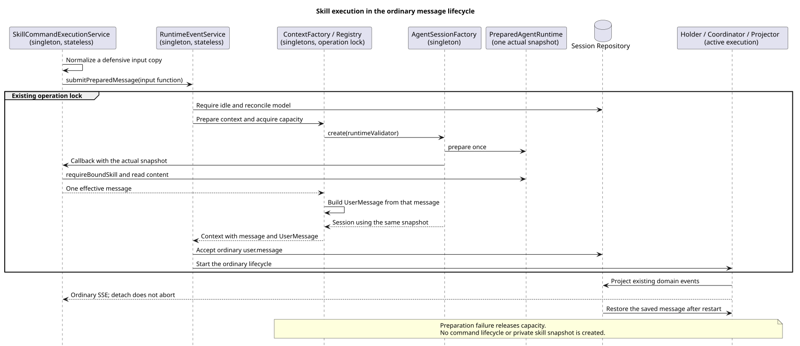

# Skill 实际输入与普通消息执行

版本：1.0.0 · 2026-09-08。

## Context 与范围

本片把已确认 Skill 输入接入已有普通消息执行链，不发布共享 POST。确认来源为用户在协调任务
「完善 built-in command 审查流程」于 2026-09-08 对请求格式及正文公开方案回复“建议执行”。
该最新决定补充设计仓 `88f4df16bc24bbfcd28e1ec374feb2de0db8be3b` 的
`04-命令与技能/02-技能命令/README.md` §4；旧待确认标记不再是本片的阻塞。
独立设计仓保持只读，HTTP 请求 VO、路由及完整 HTTP 验收由后续共享入口切片交付。

## 关键定义

- `SkillCommandInputDTO`：已经选择 Skill 类别的内部输入，`skillName` 不含 `skill:`；不含 HTTP Header。
- `SkillCommandExecutionService`：唯一业务归一化入口。原始参数超过 262144 个 UTF-16 单元即拒绝；
  缺省、null、纯空白变为无附加说明，非空参数逐字符保留。附件缺省/null 为空，最多32项，
  非空白、唯一、保序并防御复制。不增加文件 ID 正则，不静默去重。
- 实际输入：同次 `PreparedAgentRuntime` 里已直接绑定 Skill 的完整 `content` 原文；
  有附加说明时拼接两个换行及原参数。最终文本同样不得超过262144单元，不截断。
  无附加说明也可执行。既有缓存正文包含 SKILL.md frontmatter，原样保留，不重新读取路径或添加路径提示。
- 正文公开：完整实际文本作为普通 `user.message` 保存，模型、SSE、GET历史及重启恢复共用它；
  有权限读取该 Session 的客户端可看到 Skill 说明。不创建第二份正文/版本快照或额外保留期。

## 源码证据与差异

Java 分析基线：`8d61c767d09d47ef6c8d76c05535fcbb58c48373`。下列 Java 路径根为
`modules/coding-agent-cli/src/main/java/com/campusclaw/codingagent/`。

| 分类 | 相对路径与符号 | 观察或决定 |
| --- | --- | --- |
| 已有实现 | `runtime/AgentRuntimeManager.java#loadSkill` | 从完整受管缓存读取 SKILL.md，`SkillInfo.content` 是完整文本。 |
| 已有实现 | `session/AgentSessionFactory.java#create` | `prepare` 一次后先调用 `runtimeValidator`，再用同一 runtime 装配模型、工具和 Session。 |
| 已有实现 | `runtimeapi/runtime/RuntimeSessionEngineRegistry.java#register/#complete` | 操作锁、全局容量与 Holder 清理由运行层拥有，构造失败释放容量。 |
| 已有实现 | `runtimeapi/service/command/skill/SkillCommandAdmission.java#requireBoundSkill` | 在实际快照核对 Agent 身份、启用状态、精确直接绑定，不信任先前 GET。 |
| 已有实现 | `runtimeapi/event/RuntimeEntryCodec.java#userEntry/#toUserMessage/#toHistoryEvent/#toAgentMessages` | 普通输入保存、模型转换、公开投影及恢复共用消息文本。 |
| 本片实现 | `runtimeapi/service/command/skill/SkillCommandExecutionService.java#execute/#expand` | 归一化、实际绑定准入和展开，复用普通执行服务；失败只输出稳定代码。 |
| 本片实现 | `runtimeapi/event/RuntimeEventService.java#submitPreparedMessage/#acceptUserEntry` | 在同一操作锁内接受展开后的普通消息；不复制执行生命周期。 |
| 本片实现 | `runtimeapi/event/RuntimeExecutionContextFactory.java#createPreparedMessage`、`runtimeapi/dto/RuntimeExecutionContextDTO.java` | 工厂准入回调同步执行一次，生成模型消息及持久化原文，引用仅属于本次请求。 |
| 上游观察 | pi `4af9d21d3b4d664e4a29fcabfec85171077248e3`，`packages/coding-agent/src/core/agent-session.ts#_expandSkillCommand`，1320行起 | 本地读取正文、移除 frontmatter、附加参数并携带路径；未知 Skill 回退普通文本。 |

Java 差异分类：结构化内部输入、允许 name-only 与正文公开是已确认产品约束；
未知/未绑定直接拒绝、不人为添加服务器路径/凭据是安全加固；复用服务锁与领域 Entry 而非本地 CLI 是架构变更。
保留完整缓存正文避免在另一处重复解析或丢弃说明；这不是 pi 的原样行为，也不是新的公开 HTTP 协议版本。

## 架构与数据流

[PlantUML 源码](diagram.puml#L1)

Application 后续只将请求 VO 映射为内部 DTO，调用
`SkillCommandExecutionService.execute(sessionId, input, locale, credentials)`，返回现有 `RuntimeEventStream`。
Service 把绑定/展开函数交给 `RuntimeEventService.submitPreparedMessage`；普通消息入口仍使用原 `create`
及七参数 `register`。两个入口仅在输入准备方式上不同，接受、Projector、超时、执行和资源收尾相同。

`BiFunction<String, PreparedAgentRuntime, String>` 是消息准备回调，不是通用 Command Handler，
不会加入 Registry 或形成中央命令名称分派。它只在本次工厂调用内使用，不存入 Spring 单例或历史。
凭据沿现有受管 Session 透传，不参与正文拼接、不记录日志、不写入 DTO或数据库。

## 设计决策

[ADR-0071](../../decisions/0071-skill-command-message-execution.html)：同一实际快照展开、单份普通消息保存，
复用现有执行链；不先从旧 GET 缓存展开，再由 Session 工厂切换到另一份快照。

## 边界情况与性能（DFX）

- 错误名称/参数/附件在执行服务归一阶段拒绝。实际未绑定返回 `COMMAND_NOT_FOUND`；禁用、身份不符、
  不可用或空正文返回 `AGENT_NOT_AVAILABLE`；展开超限返回 `INVALID_COMMAND_REQUEST`。
- idle 检查、模型纠正、容量获取、实际快照准入、数据库接受按既有顺序执行。模型纠正可能先追加
  Model/Thinking 领域 Entry，因此不宣称任何准入失败都完全无数据库写入；失败不得接受新的 `user.message`
  或启动模型，已取得容量/Holder 必须释放。数据库竞争方的 running 状态不能被本请求清理。
- 字符串长度先以 long 计算，超限不拼接超大结果；附件列表至多复制32项。无新存储表、后台线程、通用锁或定时器。
- SSE detach 沿用普通消息语义，仅解除订阅，不取消已接受执行；终态由原 Coordinator 清理。
  不在本片迁移 Events v2、退役控制端点或更改压缩行为。

## 契约改动与验收边界

没有新增公共路由。本片内部能力为最终共享 POST 的真实 Skill 分支，不安装伪 Handler、占位成功响应、
公开 commandId 或 `command.started/completed/failed`。完整 HTTP Header、ResultBean/SSE分流和七Builtin一起验收
仍由后续切片负责。不会将普通消息 API 的 Slash 文本重新解释为命令。

## 测试与验证

- `SkillCommandExecutionServiceTest`：参数原值/缺省、附件复制与顺序、非法输入、展开长度边界、稳定错误与无正文泄漏。
- `SkillCommandExecutionOpenGaussIT`：真实 Repository、Session 工厂、Agent、Coordinator、Projector；只替换外部运行时获取及模型服务。
  验证实际快照文本进入模型、普通Entry、SSE、历史、重新建立数据库连接后的恢复；验证detach继续执行、
  绑定/禁用/超限/忙状态/容量失败与跨连接接受竞争。该测试不是跨JVM HTTP验收。
- 原 `RuntimeEventServiceTest`、`RuntimeCompactionServiceOpenGaussIT` 与 `RuntimeSessionRepositoryOpenGaussIT` 作为回归。
- 最终 `./mvnw -q spotless:apply checkstyle:check verify` 通过：394类、1889项普通测试，0失败/错误/跳过；
  其中新增服务单测25项。新增/修改测试质量脚本0错误、0警告。
- 独立创建的 openGauss 7.0.0-RC3 容器上，新 Skill IT 8项、原压缩9项、原 Repository 27项，共44项通过，
  0失败/错误/跳过。测试专属容器已删除且无残留卷；新测试逐例清理本次创建的Session记录并关闭执行与连接。
  集成命令为 `./mvnw -q -pl modules/coding-agent-cli -am
  -Dtest=SkillCommandExecutionOpenGaussIT,RuntimeCompactionServiceOpenGaussIT,RuntimeSessionRepositoryOpenGaussIT
  -Dsurefire.failIfNoSpecifiedTests=false -Dgaussdb.it.url=<dedicated-jdbc-url>
  -Dgaussdb.it.username=<dedicated-user> -Dgaussdb.it.password=<dedicated-password> test`。
- 模块新增850行，生成镜像后1700行。普通镜像同步、内容核对、`git diff --check` 通过；
  公司 `NativeParent:26.0.0-SNAPSHOT` 不可用，常规同步明确失败后采用 `--no-verify`，企业编译/JAR未验证。
- AST检查确认所涉及类全部方法/构造器不超过50非空行；两项record布局由人工复核。
  PlantUML生成、ASCII、SVG XML、Markdown链接/锚点与无Mermaid检查通过；ADR在1280/360宽度渲染无横向溢出，
  生成图和两张ADR显示已人工查看。这些检查不代替后续公开HTTP验收。

## 版本历史

| 版本 | 日期 | 变更 |
| --- | --- | --- |
| 1.0.0 | 2026-09-08 | 根据用户确认接入真实 Skill 输入、实际绑定与普通消息执行；共享 HTTP 单独交付。 |
