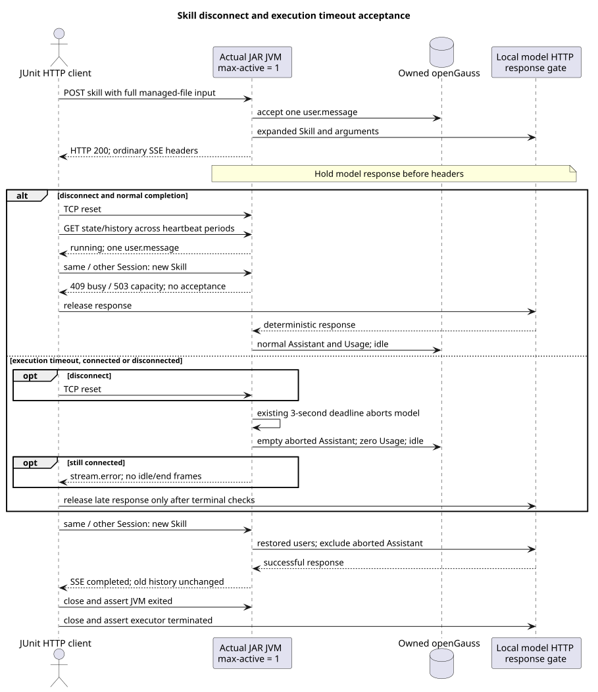

# Skill 断线、执行超时与容量复用验收

版本：1.0.0 · 日期：2026-09-08。

## Context 与范围

既有 Skill 复用普通消息执行生命周期：网络断线只解除 SSE 订阅，执行超时则取消模型并收尾。
已有单进程数据库测试直接调用 `detach()`，不能证明实际 Socket 断开后的服务行为。
本片新增 `RuntimeSkillLifecycleOpenGaussIT`，使用打包 JAR、真实本地 HTTP 与专用 openGauss，
仅外部模型由已有 HTTP/SSE 服务模拟。没有修改生产代码、共享测试辅助代码、SQL、依赖或独立设计仓。

基线为实际主线 `72f3550eabbfbf0f1cc3768430e3fc0206cb7a11`，从独立工作树开发，
不依赖尚在评审的 #257/#260。请求和正文语义沿用已合入的
[共享命令入口](../shared-command-http/README.md)与[Skill 执行](../skill-command-execution/README.md)，
以及用户2026-09-08对设计基线 `88f4df16bc24bbfcd28e1ec374feb2de0db8be3b` 的确认补充。
本片不重新设计 Skill、Events v2 或控制接口。

## 源码证据与验收理由

以下生产路径相对 `modules/coding-agent-cli/src/main/java/com/campusclaw/codingagent/`。

| 已观察主线源码 | 行为与本片验证 |
| --- | --- |
| `runtimeapi/web/RuntimeCommandController.java#executeSkill` | SSE completion/timeout/error 均只调用 detach；真实 Socket 接收200/SSE响应头后发出TCP reset，再独立观察运行与落库。 |
| `runtimeapi/event/RuntimeEventStream.java#detachInternal` | 清订阅缓冲并唤醒输出，不取消执行；模型响应尚未放行时，断线后仍为running。 |
| `runtimeapi/runtime/RuntimeExecutionProperties.java`、`runtimeapi/event/RuntimeEventProperties.java` | 已有容量、正Duration硬超时和心跳配置；仅对子JVM使用max-active=1、heartbeat=100ms，以及超时案例的max-duration=3s，不新增生产配置。 |
| `runtimeapi/event/RuntimeExecutionCoordinator.java#timeoutExecution/#completeExecution` | 超时标记并Abort，先持久化idle，再释放Holder/容量，最后输出终态；不由客户端连接生命周期决定。 |
| `runtimeapi/event/RuntimeTerminalEventFactory.java#emit/#errorEvent` | 超时保持已开始的HTTP 200 SSE，终态为stream.error及稳定错误码；不附加session.status.idle或stream.end，不能把数据库idle误认为必发idle帧。 |
| `runtimeapi/event/RuntimeEventProjector.java#persistAssistant`、`runtimeapi/event/RuntimeEntryCodec.java#assistantEntry/#usageRecord/#isRecoverableMessageEntry` | 取消后保存空aborted Assistant及零Usage；后续模型上下文排除aborted Assistant，但保留已接受User文本。 |
| `runtimeapi/runtime/RuntimeSessionEngineRegistry.java#complete` | 清Holder并释放全局容量；同Session继续和另一Session成功接受分别检查会话资源与全局资源复用。 |

另一个生产源码为 `modules/agent-core/src/main/java/com/campusclaw/agent/loop/AgentLoop.java`：
`invokeModel/synthesizeAbortedMessage/runInternal` 在取消后合成ABORTED消息并发出MessageEndEvent，
因此不能将“超时没有Assistant Entry”写成验收条件。

已合入 #255 的 `modules/coding-agent-cli/src/test/java/com/campusclaw/codingagent/runtimeapi/web/RuntimeHttpProcessFixture.java`
提供目录、实际JVM、模型响应Gate和关闭断言，直接复用；本PR新测试不是上述主线原有源码。
本片属于既有Java实现验收，不新增架构决策，也不声称pi内核具有这些HTTP行为；沿用
[ADR-0068 测试辅助代码](../../decisions/0068-reuse-runtime-http-process-fixture.html)。

## 场景与顺序



[PlantUML 源码](diagram.puml#L1)

1. 真实 Skill 请求由完整受管文件展开，模型收到正文后由Gate阻塞响应。GET历史只有一次普通user.message，
   其完整正文/附加说明与实际模型输入一致；没有私有Skill副本。
2. 正常断线场景已收到200及SSE响应头后发送TCP reset。在100ms测试心跳配置下，跨过至少500ms继续检查running。
   同Session新Skill返回409、另一Session返回503；Session/ETag、历史及模型请求次数不变。再放行模型，观察唯一正常Assistant及idle。
3. 超时场景分为保持连接与真实断线两次执行。Gate未放行前，3秒执行时限独立触发，GET返回idle及空aborted Assistant，
   累计Token为0；仍连接时检查 `stream.error` 与 `SESSION_EXECUTION_FAILED`，无正常end/idle帧。finally才释放迟到响应。
4. 三个案例都在同Session和另一Session再次成功执行Skill。旧历史前缀不变、无迟到重复结果，
   实际模型恢复包含原User及新输入；超时案例不恢复aborted Assistant。最后确认JVM退出、模型executor关闭。

## 验证方式与边界

先打包当前工作树，使用按当前完整安装SQL初始化的全新专用库；测试不执行DDL或全表清理。
新库含13表，安装及角色权限单独验证。必须显式提供以下参数，缺参导致skip，不能算通过：

```bash
./mvnw -q -pl :campusclaw-coding-agent -am package -DskipTests
./mvnw -q -pl :campusclaw-coding-agent -am test \
  -Dtest=RuntimeSkillLifecycleOpenGaussIT \
  -Dsurefire.failIfNoSpecifiedTests=false \
  -Druntime.it.jar=/absolute/path/to/campusclaw-agent.jar \
  '-Dgaussdb.it.url=jdbc:postgresql://127.0.0.1:32814/skill_lifecycle_main72?sslmode=disable' \
  -Dgaussdb.it.username=compact_user -Dgaussdb.it.password='<test-only-password>'
```

实际结果、源码/JAR哈希、最终行数及CI以PR交付证据为准；普通verify不替代这些有条件的真实进程测试。
新增测试还执行既有测试质量脚本、Spotless/Checkstyle、Java AST方法长度及镜像校验。
公司NativeParent不可解析时，只能显式生成本地镜像，企业编译应标未验证。

本片不证明生产Mate/真实模型质量、实际30分钟墙钟等待、任意网络故障、精确的服务端断线回调完成时刻、
进程崩溃、提交结果不确定性、控制队列清空或凭据内存清理。100ms心跳和500ms观察增加真实断线后的观察窗口，
不是新的服务端探测接口；未通过睡眠或Future.cancel代替实际Socket断线，也未通过放行Gate假装超时。

## 版本历史

| 版本 | 日期 | 说明 |
| --- | --- | --- |
| 1.0.0 | 2026-09-08 | 增加Skill真实RST、连接/断线超时及同异Session资源复用验收。 |
