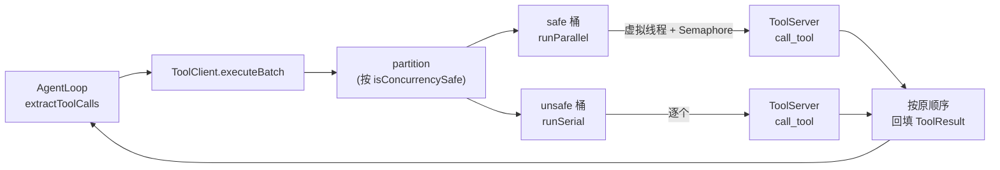

# 工具调用 Client(ToolClient)设计文档

> 模块:`agent-core` / `coding-agent-cli`
> 状态:Proposed
> 日期:2026-07-29
> 作者:TestCat
> 关联 ADR:待补(建议 `docs/decisions/NNNN-tool-client-concurrency.html`)

---

## 1. 背景(Context)

pi-mono-java 重构中,工具执行从**进程内**(`ToolExecutionPipeline` 直接调用本地工具实现)拆成 **client-server** 架构:

- **ToolServer**:实际执行工具的服务端(独立进程 / 远程),对外暴露 `list_tools` / `call_tool` 两个核心接口。
- **ToolClient**:运行在 AgentLoop 端的客户端,通过上述接口把 AgentLoop 产出的 tool_use 批次转发给 server,再把结果按序回填给 AgentLoop。

本设计文档聚焦 **ToolClient 的串行/并行调度**——参考 Claude Code 的 `partitionToolCalls` 机制,让"只读工具并行、写/执行工具串行",在工具调用远程化之后仍保留吞吐与安全。

### 为什么需要

- 当前 `ToolExecutionPipeline` 只有一个全局 `ToolExecutionMode`(`SEQUENTIAL` 默认 / `PARALLEL`),整批要么全串行要么全并行,粒度太粗(见 `Agent.java:86`、`ToolExecutionPipeline.java:149`)。
- 工具远程化后,网络往返成本显著,**只读工具并行可大幅降低批次延迟**;但写/执行工具必须串行以避免副作用冲突。
- 需要一个调度层:在不让 client 盲猜工具副作用的前提下,做到"只读并行 + 写串行 + 保序 + 限流保护 server"。

### 非目标

- 不在本设计范围:ToolServer 的内部实现、传输层(HTTP / stdio / RPC 具体协议)、ToolServer 自身的并发模型(见 §5 对齐项)。
- 不替换 `ToolExecutionPipeline` 的 before/after hook、JSON Schema 校验等单工具管线能力(这些在 client 调用 server 前后仍可保留或迁移,本文不展开)。

---

## 2. 关键定义

| 名称 | 类型 | 说明 |
|---|---|---|
| `ToolClient` | 类 | AgentLoop 端客户端,负责批次调度(parition + 并行/串行 + 保序回填) |
| `ToolServerClient` | 接口 | 底层 RPC 传输层抽象,实现 `listTools()` / `callTool(call, timeout)` |
| `ToolMeta` | record | 工具元数据,由 server `list_tools` 返回:`(name, inputScheme, outputScheme, isConcurrencySafe)` |
| `ToolCall` | record | 一次工具调用:`(id, toolName, args)` |
| `ToolResult` | record | 调用结果:`(id, content, isError)` |
| `Batch` | record | partition 产出的桶:`(safe, calls)` |
| `isConcurrencySafe` | 布尔 | 工具是否并发安全(**只读/无副作用=true**,写/执行=false);由 **server 声明**,通过 `list_tools` 告知 client |

---

## 3. 架构与数据流

### 3.1 整体链路

```
AgentLoop
  └─ extractToolCalls(assistantMessage) ──► List<ToolCall>
       └─ ToolClient.executeBatch(calls)
            ├─ partition(calls)            // 按 isConcurrencySafe 分桶
            │     └─ [Batch(safe), Batch(unsafe), ...]
            ├─ for each Batch:
            │     ├─ safe   ──► runParallel  // 虚拟线程 + Semaphore 限流
            │     └─ unsafe ──► runSerial    // 逐个,保序
            └─ 按原 calls 顺序回填 ──► List<ToolResult>
       └─ AgentLoop 继续 turn
```

### 3.2 数据流图



### 3.3 partition 规则(等价 CC 的 `partitionToolCalls`)

遍历 `calls`,对每个 call:

1. 查 `isConcurrencySafe(toolName)`(从元数据缓存);
2. **当前 safe 且上一桶也是 safe** → 合并进上一桶(连续只读聚一起);
3. **否则** → 新开一桶(safe 但上一桶是 unsafe → 也新开,保证不跨越写工具合并)。

例:`[Read, Read, Grep, Bash, Read]`

```
桶1 (safe): Read, Read, Grep  ──► 并行
桶2 (unsafe): Bash            ──► 串行
桶3 (safe): Read              ──► 并行(虽只 1 个,但不与桶1跨 Bash 合并)
```

桶之间按原顺序执行,**整体保序**。

---

## 4. 设计决策

### D1. 调度放 client 端(非 server 端)

- **决策**:partition + 并行/串行调度在 client。
- **理由**:
  - client 是 AgentLoop 的直接对接方,保序 / 失败回填 / 并发限流的语义天然在 client;
  - client 能保护 server(Semaphore 限流),把调度权放 server 等于放弃这层保护;
  - 与 Claude Code 形态一致(CC 的 `toolOrchestration` 在调用方调度,工具方只声明 `isConcurrencySafe`)。
- **否决项**:server 端自治(client 发 batch、server 自己 partition)——client 过薄,失去限流 / 失败策略控制。

### D2. `isConcurrencySafe` 由 server 声明,经 `list_tools` 下发

- **决策**:工具元数据自定义,`list_tools` 返回 `ToolMeta(name, isConcurrencySafe)`;client 缓存后用于 partition。
- **理由**:client 调远程工具,**不知道工具内部副作用**;只有 server(执行工具)知道。让声明方 = 知情方,client 只消费。
- **兜底**:元数据缺失 / `isConcurrencySafe` 未声明 → **默认 false(串行)**,保守不会错。

### D3. 失败默认独立(不级联取消兄弟)

- **决策**:单个 `call_tool` 失败 → 返错误 `ToolResult`,**不影响同批其他工具**。
- **理由**:远程失败多是网络 / 超时 / 限流,**不该连累兄弟**。这与 Claude Code 本地的"兄弟失败级联取消"(`sibling_error`)**相反**——CC 那个是为本地副作用一致性设计的,远程场景不适用。
- **可扩展**:若个别工具要求级联,可在 `ToolMeta` 加字段扩展(本期不做)。

### D4. 并发上限用 `Semaphore`,可配

- **决策**:`Semaphore(maxConcurrency)`,默认 5,可配。
- **理由**:远程调用 + 可能多 agent 共享一个 server,client 必须限流保护 server。CC 本地默认 10,远程建议更保守。

### D5. 虚拟线程并行

- **决策**:`Executors.newVirtualThreadPerTaskExecutor()`。
- **理由**:远程调用 IO 密集,虚拟线程轻量、高并发性价比高;与 pi-mono 现有 `executeInParallel` 风格一致。

### D6. per-call 超时

- **决策**:每次 `call_tool` 带 `Duration timeout`,超时返错误结果。
- **理由**:远程调用必须可超时;AgentLoop 整体也有 `CancellationToken`,但 per-call 超时是细粒度兜底。

### D7. 保序回填

- **决策**:结果按原 `calls` 顺序返回给 AgentLoop(内部用 `ConcurrentHashMap<id, result>` + 最后按原顺序 map)。
- **理由**:AgentLoop 把 tool_result 喂回模型时,顺序需与 tool_use 对齐,否则模型可能困惑。

### D8. 工具直接注入 agent,而非做成 `listTool` / `callTool` 两个工具

- **决策**:server 的工具(read/grep/bash 等)启动时 `list_tools` 拉取一次,把工具定义(含 `input_scheme` / `output_scheme` / `isConcurrencySafe`)注入 agent 的工具集——经 **API 的 `tools` 字段**声明(不是 system prompt 文本;system prompt 仅放工具使用指导,不放工具 schema),agent 直接调用;ToolClient 内部仍走 `list_tools` / `call_tool` 协议与 server 通信。**不**把 list / call 做成 agent 的两个工具。
- **核心理由(最重要)**:工具调用必须走模型 API 原生的 `tools` 机制,而不是让 agent 从对话历史里推理。
  - **注入(A 方案)**:工具经 API `tools` 参数声明 → 模型用原生工具调用机制生成 tool_use,训练高度对齐,可靠性最高。
  - **两工具(B 方案)**:工具列表在 `list_tools` 的返回内容里(对话历史 message),模型在 `tools` 参数里看不到这些工具,只能"读历史 → 识别工具列表 → 拼造 `call_tool`"。等于把工具调用从 API 原生机制**降级成对话历史里的文本推理**,模型遵循度明显下降——这是 B 改不了的结构性缺陷。
- **其他论据**:
  - **schema 校验后置(非丢失)**:元数据带 `input_scheme`,B 在 `call_tool` 内部查 toolName 的 scheme 能校验 args;但校验推到运行时,框架层 `call_tool` 的 inputSchema 仍是 generic,权限 / before hook 拿不到结构化字段(如 `file_path`)。A 在框架级前置校验(`tool.inputSchema` safeParse),执行前就拦坏输入。
  - **loop 执行不确定**:B 下 agent 可能不 `list` 就直接 `call`(瞎调)或乱序;A 工具直接可用,无此问题。
  - **每轮 list / 依赖历史**:B 要么每次 `list_tools`(浪费往返),要么依赖前几轮的 list 结果(长对话易忘)。
  - **框架层区分**:权限 / hook / 日志 / 事件按 `tool_use.name` 区分工具;B 下永远 `call_tool`,要解包 `toolName` 才知实际工具。
  - **并行:打平(非分水岭)**:B 的 `call_tool.isConcurrencySafe(input.toolName)` 按 toolName 查元数据,同样能 partition;并行**不是** A vs B 的取舍点。
- **否决项**:`listTool` / `callTool` 两工具方案——实现极简(不动 AgentLoop),但把工具调用降级成对话推理 + schema 后置 + 框架层解包,可靠性差;仅 MVP 偷懒可用,终点应是 A。

### 参考实现

Claude Code `source/extracted/src/services/tools/toolOrchestration.ts`:
- `partitionToolCalls`(分桶)
- `runToolsConcurrently` + `getMaxToolUseConcurrency`(`CLAUDE_CODE_MAX_TOOL_USE_CONCURRENCY`,默认 10)
- `runToolsSerially`
- 工具自声明 `isConcurrencySafe(input)`

差异:CC 工具本地、自声明、失败级联;本设计工具远程、server 声明、失败独立。

---

## 5. 边界情况

| 场景 | 处理 |
|---|---|
| `list_tools` 未返回某工具 / 无 `isConcurrencySafe` | `isConcurrencySafe` 查不到 → 默认 `false`(串行) |
| 元数据缓存过期(工具集变动) | 调用方触发 `refreshToolMeta()` 重新拉取;`volatile` 缓存保证可见性 |
| 空批次 | 直接返回 `List.of()` |
| 单工具超时 | `callTool` 抛超时 → `callRemote` catch → 返 `isError=true` 的 `ToolResult`,不影响兄弟 |
| 单工具失败 | 同上,失败独立(见 D3) |
| 中断 | `InterruptedException` 恢复中断位 + 抛 `IllegalStateException`(符合 `no_silent_catch` / `no_throw_runtime_exception`) |
| server 端不并发(单线程排队) | client 并行**退化为排队**;需与 server 团队对齐 server 多线程能力(见 §9 验证) |
| 限流(Semaphore 耗尽) | 新调用阻塞等 permit;中断时恢复中断位 + 返错误结果 |

---

## 6. 性能与 DFX

| 维度 | 策略 |
|---|---|
| 延迟 | 只读段 N 个工具并行 → 批次延迟从 `sum(latency)` 降到 `max(latency)`;写段串行不可避免 |
| 并发上限 | 可配(`maxConcurrency`,默认 5),`Semaphore` 强制;保护 server 不被打满 |
| 线程成本 | 虚拟线程,几乎无创建成本,适合 IO 并行 |
| 元数据查询 | 启动 `refreshToolMeta` 一次,`Map` 查 O(1);工具集变动时刷新 |
| 可观测 | SLF4J 记录:每次 `call_tool` 的工具名、失败原因、(可选)耗时;符合 `no_system_out_err` / `no_chinese_in_log` |
| 资源释放 | `try-with-resources` 包 `newVirtualThreadPerTaskExecutor`,批次结束自动关 |

---

## 7. 契约改动

### 7.1 `list_tools` 返回扩展

```jsonc
// 返回:工具元数据列表(含 input_scheme / output_scheme / isConcurrencySafe)
[
  {
    "name": "read",
    "inputScheme":  { "type": "object", "required": ["file_path"], "properties": { "file_path": { "type": "string" } } },
    "outputScheme": { "type": "string" },
    "isConcurrencySafe": true
  },
  {
    "name": "bash",
    "inputScheme":  { "type": "object", "required": ["command"], "properties": { "command": { "type": "string" } } },
    "outputScheme": { "type": "object", "properties": { "stdout": { "type": "string" }, "exitCode": { "type": "integer" } } },
    "isConcurrencySafe": false
  }
]
```

### 7.2 `call_tool` 接口

```jsonc
// 请求
{ "id": "toolu_xxx", "toolName": "read", "args": { "file_path": "/a/b" } }
// 响应
{ "id": "toolu_xxx", "content": "...", "isError": false }
```
传输层带 per-call 超时。

### 7.3 ToolClient 对外接口

```java
public class ToolClient {
    public void refreshToolMeta();                          // 拉取/刷新工具元数据
    public List<ToolResult> executeBatch(List<ToolCall> calls);  // 批次调度
}
```

### 7.4 AgentLoop 改造点

原 `ToolExecutionPipeline.executeAll(calls, mode, ...)` 的调用位置,替换为 `ToolClient.executeBatch(calls)`(mode 语义被 partition 取代)。`runToolPhase` 的 `resolveToolCallsSafe`(未知工具合成错误结果)、事件广播等保留。

---

## 8. 测试策略

| 测试 | 覆盖 |
|---|---|
| `partition` 单测 | 全 safe(合并 1 桶)/ 全 unsafe(每call一桶)/ 混合(连续 safe 合并、unsafe 断开)/ 元数据缺失(默认串行) |
| `runParallel` | 并发数 ≤ `maxConcurrency`(Semaphore 验证)/ 虚拟线程 / 结果正确 |
| `runSerial` | 严格顺序 |
| 保序 | 输出顺序 == 输入顺序(含并行段乱序完成) |
| 失败独立 | 一个 `call_tool` 抛异常,其他仍正常返回;失败项 `isError=true` |
| 超时 | `callTool` 超时 → 错误结果 |
| 中断 | `InterruptedException` → 中断位恢复 + `IllegalStateException` |
| 元数据刷新 | `refreshToolMeta` 后新工具可查 |

单测用 mock `ToolServerClient`(`listTools` 返回固定元数据,`callTool` 模拟延迟 / 失败 / 超时)。遵守 pi-mono 测试规范(`no_fake_assertion_*`、每个 `@Test` 有真实断言)。

---

## 9. 验证清单

- [ ] `partition` 对各种 tool_use 序列分桶正确(含跨 unsafe 不合并);
- [ ] `executeBatch` 输出与输入同序(含并行段);
- [ ] 并发数受 `Semaphore` 约束(用计数器验证同时 in-flight ≤ `maxConcurrency`);
- [ ] 单工具失败 / 超时不影响兄弟(失败独立);
- [ ] 元数据缺失时退化全串行(安全兜底);
- [ ] **server 端并发能力对齐**:确认 ToolServer 是多线程 / 异步处理 `call_tool`,否则 client 并行退化为 server 排队(跨团队依赖项);
- [ ] Checkstyle / Spotless 通过(版权头、SLF4J、`IllegalStateException`、catch 不静默、camelCase);
- [ ] 端到端:AgentLoop → ToolClient → mock ToolServer,验证批次调度 + 结果回填。

---

## 10. 开放问题

1. **server 端并发模型**:ToolServer 收到并发 `call_tool` 如何执行(线程池?异步?)——需 server 团队确认,直接影响 client 并行的实际收益。
2. **元数据刷新时机**:启动拉一次足够,还是工具集变更时主动 push / 定期 pull?
3. **流式结果**:若未来 `call_tool` 要返回流式(进度 / 分块),是否引入类似 CC `StreamingToolExecutor` 的流式调度器(本期不做,同步请求-响应优先)。
4. **级联取消扩展**:是否在 `ToolMeta` 加 `cascadeOnSiblingError` 字段支持个别工具要求级联(本期不做)。
