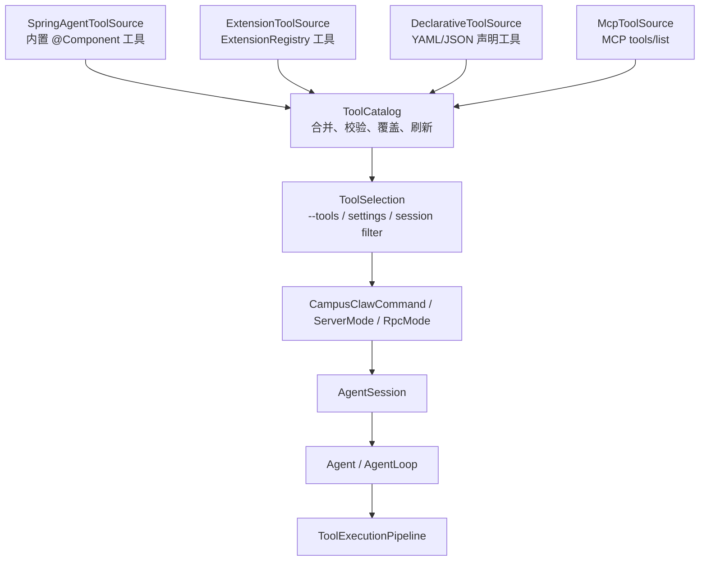

# pi-mono-java 工具系统对齐 PI 设计 Spec

## 文档信息

| 项目 | 内容 |
|---|---|
| Story 编号 | tool-system-alignment |
| Story 名称 | pi-mono-java 工具模块与 PI 工具系统对齐 |
| 负责人 | CampusClaw 工具系统维护者 |
| 创建日期 | 2026-06-12 |
| 版本 | v1.0 |
| 输入依据 | 根目录 `tool-system.html`、`pi` TypeScript 工具/扩展实现、`pi-mono-java` 现有源码 |

---

## 1. 背景与目标

`tool-system.html` 已完成 CampusClaw/PI 工具系统调研，指出 Java 侧现状是：`AgentTool` 抽象清晰，`ToolExecutionPipeline` 已有 schema 校验、before/after hook、串并行执行能力，`coding-agent-cli` 中的工具实现通过 Spring `@Component` 静态注入 `List<AgentTool>`。同时，`extension/ExtensionRegistry` 虽有接口和测试价值，但没有进入生产装配路径；MCP 仅在 ACP 子 Agent 的 `NewSessionRequest.mcpServers` 中透传，没有一级工具适配器。

PI TypeScript 侧的优势在于工具工厂、扩展加载、运行时注册、工具替换和活动工具集管理更灵活。Java 侧的优势是 Spring 生态、企业安全治理、Hybrid 沙箱和 JDK 21 虚拟线程。对齐目标不是把 Java 改成 TypeScript 风格，而是在保留 `AgentTool` 与现有执行管线的前提下，补上 PI 的扩展能力。

本 spec 目标：

1. 将内置工具、扩展工具、声明式工具、MCP 工具统一进入生产工具目录。
2. 支持新增工具、替换同名工具、运行时刷新、按层级启停工具。
3. 以 `AgentTool` 为唯一 LLM 可见执行契约，不破坏现有工具实现。
4. MCP Server 通过适配器暴露为普通 `AgentTool`，复用现有 schema 校验、事件、取消和沙箱策略。
5. 让 `CampusClawCommand`、`AgentSession`、server/rpc/interactive 模式使用同一套有效工具解析逻辑。

非目标：

- 不在首版实现任意第三方 Java 字节码热加载到宿主 JVM。
- 不替换 `ToolExecutionPipeline` 的核心执行模型。
- 不把 Skill 提示词包改造成工具包；Skill 仍负责提示词和知识扩展。
- 不内置 PI 侧 TypeScript extension runtime。

---

## 2. 现状分析

### 2.1 Java 侧现状

| 位置 | 现状 | 对齐缺口 |
|---|---|---|
| `modules/agent-core/.../AgentTool.java` | 5 方法契约：`name`、`label`、`description`、`parameters`、`execute` | 缺少工具元数据、来源、默认执行模式、参数预处理等可选扩展 |
| `ToolExecutionPipeline` | before hook、schema 校验、execute、after hook；支持 SEQUENTIAL/PARALLEL | before hook 不能改写参数；parallel 阶段会并发跑完整 pipeline；没有 per-tool mode |
| `AgentLoop` | 每轮从 `context.tools()` 转为 LLM `Tool`；未知工具返回错误 | 工具列表在 session 初始化后静态固定 |
| `CampusClawCommand` | Spring 注入 `List<AgentTool>`，`--tools` 只做名称过滤 | 没有优先级、替换规则、扩展来源、动态刷新 |
| `extension/` | `Extension` / `ExtensionRegistry` 可贡献 tool/command/hook/listener | 未注册成 Spring Bean，生产路径未使用 |
| `tool/execution` | Hybrid 工具可路由 LOCAL/SANDBOX/AUTO | 只覆盖已知内置工具，不适配外部动态工具 |
| MCP | ACP 子 Agent 请求支持 `mcpServers` 字段 | 主 Agent 没有 MCP client、list/call 适配、配置与生命周期管理 |

### 2.2 PI TypeScript 侧可借鉴能力

| 能力 | PI 做法 | Java 对齐方式 |
|---|---|---|
| 工具工厂 | `createTool(name, cwd, options)` / `createAllTools` | 保留 Spring Bean，增加 `ToolSource` 汇聚多来源 |
| 扩展注册 | extension API `registerTool()` 后 refresh | Java 增加 `ToolCatalog.refresh()` 与 `ToolChangeListener` |
| 活动工具集 | runtime 提供 get/set active tools | Java 增加 `ToolSelection`，统一处理 `--tools`、配置启停、会话覆盖 |
| 替换工具 | 同名注册覆盖或包装 | Java 使用分层优先级 + `replace` 策略，不依赖 Spring Bean 冲突 |
| MCP | PI README 当前不内置 MCP，建议 extension 实现 | Java 首版内置 MCP 适配器，因为 `tool-system.html` 明确要求 MCP 接入 |

---

## 3. 总体方案

推荐方案：新增 `ToolCatalog + ToolSource` 汇总层。



核心原则：

1. `AgentTool` 仍是唯一执行接口；外部系统都适配成 `AgentTool`。
2. `ToolCatalog` 是生产路径的唯一工具汇聚入口，替代 CLI 直接使用 `List<AgentTool>`。
3. 工具来源通过 `ToolSource` 插拔，内置 Spring 工具只是其中一层。
4. 同名工具冲突用声明式策略处理：`ADD`、`REPLACE`、`WRAP`、`DISABLE`。
5. 动态加载首版只动态加载声明式进程工具和 MCP 工具；Java class/JAR 插件保留接口，不默认启用。

---

## 4. 功能需求

### 4.1 新增工具

新增工具支持三类来源：

1. Spring 内置工具：开发者新增 `@Component` 实现 `AgentTool`。
2. 声明式进程工具：用户在项目或用户目录放置 `tool.yaml`，由宿主进程调用外部命令。
3. MCP 工具：配置 MCP server 后，`tools/list` 返回的每个工具映射为一个 `AgentTool`。

声明式进程工具示例：

```yaml
apiVersion: campusclaw.dev/v1
kind: Tool
metadata:
  name: jira_search
  label: Jira Search
  source: project
spec:
  description: Search Jira issues by JQL.
  inputSchema:
    type: object
    required: [jql]
    properties:
      jql:
        type: string
  execution:
    type: process
    command: ["python3", ".campusclaw/tools/jira_search.py"]
    timeoutSeconds: 30
    sandbox: auto
  merge:
    strategy: ADD
```

验收：

- 同一工具在 `AgentLoop.toLlmTools()` 中表现为普通 `Tool(name, description, parameters)`。
- schema 校验仍由 `ToolExecutionPipeline` 执行。
- 工具执行结果转换为 `AgentToolResult`，支持 `TextContent` 与 structured `details`。

### 4.2 替换工具

替换支持两种场景：

1. 完全替换：项目工具 `name=bash` 且 `merge.strategy=REPLACE`，覆盖内置 bash。
2. 包装替换：`WRAP` 保留原工具引用，在执行前后增加策略，例如审计、审批、结果脱敏。

合并优先级从低到高：

| 层级 | 来源 | 优先级 |
|---|---|---|
| system | 内置 Spring 工具 | 100 |
| extension | 安装扩展 | 200 |
| user | `~/.campusclaw/tools` | 300 |
| project | `<cwd>/.campusclaw/tools` | 400 |
| session | 当前会话临时注册 | 500 |

冲突规则：

- `ADD` 遇到同名工具失败，返回可诊断错误。
- `REPLACE` 需要显式声明 `replaces: <toolName>`，默认记录原工具来源。
- `DISABLE` 只隐藏目标工具，不删除原定义。
- 内置高风险工具如 `bash`、`write`、`edit` 被替换时，默认要求 `trust=trusted` 或用户配置允许。

### 4.3 动态加载与刷新

新增 `ToolCatalog.refresh(ToolRefreshRequest request)`：

- 重新扫描声明式工具目录。
- 重新请求 MCP `tools/list`。
- 重新聚合 ExtensionRegistry 的工具。
- 保留当前正在执行的工具快照，不中断本轮工具调用。
- 下一轮 LLM 调用使用刷新后的工具列表。

触发方式：

- CLI `/reload`：复用现有 reload 入口，同时刷新 tools、skills、prompt templates。
- Server API：新增 `POST /api/tools/reload`。
- 配置文件监听：首版不实现自动监听；后续可通过 `tools.watch.enabled=true` 作为开关接入。

一致性要求：

- `AgentState.tools` 保存不可变快照。
- `ToolCatalog` 内部使用 copy-on-write 快照。
- 刷新失败不污染旧快照，返回失败诊断并保留上一版本。

### 4.4 MCP 接入

MCP 适配分三层：

1. `McpClient`：管理 JSON-RPC 2.0 连接，支持 stdio 和 HTTP transport。
2. `McpToolSource`：对每个 server 调 `tools/list`，生成 `McpAgentTool`。
3. `McpAgentTool`：执行时调用 `tools/call`，把 MCP content 转成 `AgentToolResult`。

配置示例：

```json
{
  "tools": {
    "mcpServers": {
      "filesystem": {
        "transport": "stdio",
        "command": "npx",
        "args": ["-y", "@modelcontextprotocol/server-filesystem", "/workspace"],
        "enabled": true,
        "trust": "trusted"
      },
      "internalSearch": {
        "transport": "http",
        "url": "http://127.0.0.1:8765/mcp",
        "enabled": true,
        "trust": "untrusted"
      }
    }
  }
}
```

命名规则：

- 默认工具名为 `<serverName>__<toolName>`，避免与内置工具冲突。
- 可配置 `namePrefix` 或 `exposeNames: raw`，raw 模式下冲突必须使用 `REPLACE`。

安全要求：

- untrusted MCP 默认不能替换内置工具。
- MCP server 环境变量必须显式 allowlist，禁止默认继承完整宿主环境。
- stdio 进程有启动超时、调用超时、最大输出大小限制。
- 所有 MCP 调用都要支持 `CancellationToken`，取消时终止请求；stdio server 可按配置选择保留或关闭进程。

### 4.5 工具选择与可见性

`--tools`、settings、server session config 都统一进入 `ToolSelection`：

```java
public record ToolSelection(
        Set<String> include,
        Set<String> exclude,
        boolean noTools,
        boolean includeReadOnlyPreset,
        boolean includeCodingPreset) {}
```

规则：

- `--no-tools` 优先级最高。
- `--tools read,bash` 只选择最终 catalog 中同名工具。
- settings 可设置默认启用/禁用工具，CLI 参数覆盖 settings。
- server 模式每个 session 可有独立工具快照。

### 4.6 Hook 对齐

首版保持 `BeforeToolCallHandler` / `AfterToolCallHandler`，但新增可选增强：

1. `BeforeToolCallResult` 支持 `argsOverride`，允许 hook 改写参数。
2. `AgentTool` 增加 default `prepareArguments(Map<String, Object> rawArgs)`，用于旧 session schema 兼容。
3. `AgentTool` 增加 default `defaultExecutionMode()`，支持 per-tool sequential 偏好。

执行语义：

- 参数预处理发生在 schema 校验前。
- before hook 仍串行执行，防止审批/确认类 hook 并发交错。
- 当任一工具 `defaultExecutionMode() == SEQUENTIAL` 时，整批工具使用串行执行，与 PI 的保守策略对齐。

---

## 5. 模块与接口设计

### 5.1 新增包结构

```text
modules/coding-agent-cli/src/main/java/com/campusclaw/codingagent/tool/catalog/
  ToolCatalog.java
  ToolCatalogSnapshot.java
  ToolChangeListener.java
  ToolContribution.java
  ToolContributionSource.java
  ToolMergeStrategy.java
  ToolSelection.java
  ToolSource.java
  SpringAgentToolSource.java
  ExtensionToolSource.java
  DeclarativeToolSource.java
  ToolDeclaration.java
  ToolDeclarationLoader.java
  ProcessAgentTool.java

modules/coding-agent-cli/src/main/java/com/campusclaw/codingagent/tool/mcp/
  McpClient.java
  McpClientFactory.java
  McpServerConfig.java
  McpToolSource.java
  McpAgentTool.java
  McpContentMapper.java
  StdioMcpTransport.java
  HttpMcpTransport.java
```

### 5.2 核心接口

```java
public interface ToolSource {
    String id();

    List<ToolContribution> load(ToolSourceContext context);
}
```

```java
public record ToolContribution(
        AgentTool tool,
        ToolContributionSource source,
        int priority,
        ToolMergeStrategy mergeStrategy,
        String replaces,
        boolean enabledByDefault,
        ToolTrustLevel trustLevel) {}
```

```java
public interface ToolCatalog {
    ToolCatalogSnapshot snapshot();

    ToolCatalogSnapshot refresh();

    ToolCatalogSnapshot refresh(ToolRefreshRequest request);

    List<AgentTool> resolve(ToolSelection selection);

    Runnable addChangeListener(ToolChangeListener listener);
}
```

`ToolCatalogSnapshot` 必须包含：

- `version`：单调递增。
- `toolsByName`：最终有效工具。
- `diagnostics`：加载失败、冲突、禁用原因。
- `sources`：每个工具来自哪个 source 和层级。

### 5.3 生产装配变更

`CampusClawCommand` 不再直接保存 `List<AgentTool>` 作为最终工具，而是注入 `ToolCatalog`：

```text
Spring List<AgentTool> -> SpringAgentToolSource -> ToolCatalog
CampusClawCommand.resolveEffectiveTools() -> toolCatalog.resolve(selection)
AgentSession.initialize() -> agent.setTools(effectiveToolsSnapshot)
```

server 模式：

- `ServerMode` / `SessionPool` 保存 `ToolCatalog`，每个 session 初始化时解析一次。
- `GET /api/tools` 返回当前 catalog version、diagnostics、activeSessions 和 selection 后的工具名。
- `POST /api/tools/reload` 刷新 catalog，并对 `SessionPool` 中的活跃 session 执行 `reload()`；无 catalog 时返回 `status: disabled`。

cron 模式：

- `CronJobExecutor` 当前仍使用 `List<AgentTool>` 注入与 job payload 中的 `allowedTools` 过滤。`ToolCatalog` 位于 `coding-agent-cli` 模块，而 `cron` 是其上游依赖；直接让 cron 依赖 CLI 会形成模块环。该项需要先把 catalog API 下沉到 `agent-core` 或独立 shared module，再替换 cron executor 路径。

### 5.4 配置设计

新增 settings 片段：

```json
{
  "tools": {
    "enabled": true,
    "include": [],
    "exclude": [],
    "allowProjectTools": true,
    "allowUserTools": true,
    "allowToolReplacement": true,
    "watch": {
      "enabled": false
    },
    "mcpServers": {}
  }
}
```

新增 application.yml 片段：

```yaml
tools:
  catalog:
    project-tools-enabled: true
    user-tools-enabled: true
    replacement-enabled: true
    mcp-enabled: true
    load-timeout-seconds: 10
    max-tool-output-bytes: 1048576
```

---

## 6. 安全与权限

| 风险 | 设计约束 |
|---|---|
| 项目目录投毒 | project tools 默认需要 trusted cwd；未信任项目只加载内置工具 |
| 同名替换内置高危工具 | 需要显式 `REPLACE` + trusted source；诊断中记录替换链 |
| MCP server 泄露环境变量 | 默认空环境，只传 allowlist |
| 外部进程长时间运行 | 启动超时、调用超时、输出大小限制、取消传播 |
| 动态 Java 插件越权 | 首版不启用外部 JAR 热加载 |
| 并发工具写文件冲突 | 写类工具默认 `defaultExecutionMode=SEQUENTIAL` 或进入文件变更队列 |
| 沙箱绕过 | untrusted 声明式工具默认 `sandbox=required`；MCP 按 server trust 限制能力 |

---

## 7. 兼容性与迁移

兼容性策略：

- 现有 `AgentTool` 实现无需修改即可被 `SpringAgentToolSource` 收集。
- `--tools`、`--no-tools` 用户体验保持不变。
- 未配置 tools catalog 时，最终有效工具列表与当前 Spring 注入列表一致。
- `ExtensionRegistry` 保留现有接口，新增 Spring Bean 装配后进入生产路径。
- MCP 默认关闭或空配置，不影响启动性能与离线使用。

迁移步骤：

1. 先引入 catalog，但只接 Spring 内置工具，证明行为不变。
2. 接入 `ExtensionToolSource`，让已有 extension 测试进入生产装配。
3. 接入声明式工具 loader。
4. 接入 MCP client/source。
5. 增加 reload/API/诊断命令。

---

## 8. 测试与验收

### 8.1 单元测试

| 测试类 | 覆盖点 |
|---|---|
| `ToolCatalogTest` | 多来源合并、优先级、ADD 冲突、REPLACE 覆盖、DISABLE 隐藏 |
| `ToolSelectionTest` | `--tools`、exclude、noTools、settings 合并 |
| `DeclarativeToolSourceTest` | YAML 解析、schema 校验、process tool 执行、超时 |
| `McpToolSourceTest` | `tools/list` 发现、命名规则、冲突诊断 |
| `McpAgentToolTest` | `tools/call` 参数传递、content 映射、错误映射、取消 |
| `ExtensionToolSourceTest` | `ExtensionRegistry.getAllTools()` 进入 catalog |
| `CampusClawCommandToolCatalogTest` | CLI 使用 catalog resolve，不再直接过滤 Spring list |
| `SessionPoolToolStatusTest` | server 工具状态输出、selection 后工具列表 |
| `ServerModeTest` | `/api/tools` 与 `/api/tools/reload` 路由注册 |

### 8.2 集成测试

1. 默认启动无 tools 配置，工具列表与当前内置工具一致。
2. 项目声明新增 `hello_tool`，LLM context 中出现该工具。
3. 项目声明替换 `read`，实际调用进入替换工具。
4. `/reload` 或 `POST /api/tools/reload` 后刷新 catalog，活跃 session reload 后可见。
5. fake MCP server 暴露 `echo`，Agent 调用 `server__echo` 返回结果。
6. untrusted MCP raw 名称试图替换 `bash` 时被拒绝。

### 8.3 验收标准

- 现有 `./mvnw -pl modules/agent-core test` 通过。
- 现有 `./mvnw -pl modules/coding-agent-cli test` 通过。
- 新增工具 catalog 和 MCP 测试通过。
- `tool-system.html` 中的新增、替换、动态加载、MCP 接入要求均有对应实现路径。
- 文档更新 `docs/designs/coding-agent-cli.md` 或新增链接，说明 ToolCatalog 是生产工具入口。

---

## 9. 里程碑

| 阶段 | 内容 | 结果 |
|---|---|---|
| M1 | ToolCatalog + SpringAgentToolSource | 生产路径统一入口，行为不变 |
| M2 | ExtensionToolSource + 替换策略 | extension 工具进入生产，支持同名替换 |
| M3 | DeclarativeToolSource + ProcessAgentTool | 支持项目/用户声明式新增工具 |
| M4 | McpClient + McpToolSource + McpAgentTool | MCP 工具可被主 Agent 调用 |
| M5 | reload/API/诊断 | 动态刷新与可观测性闭环 |

---

## 10. 开放问题

1. `settings.json` 已允许 `tools` 顶层字段，当前支持 `include` / `exclude` / `noTools` / `mcpServers`。
2. MCP HTTP transport 当前采用简单 JSON-RPC over HTTP；Streamable HTTP 可作为后续兼容增强。
3. untrusted process tool 是否必须强制 Docker 沙箱；如果用户无 Docker，是否直接禁用。
4. `prepareArguments`、`defaultExecutionMode` 已进入 `agent-core` 的 `AgentTool` 默认方法与执行 pipeline。
5. server 模式 `POST /api/tools/reload` 当前会刷新 catalog 并 reload `SessionPool` 活跃 session；单个 API session 级独立 tool selection 仍未建模。
6. cron executor 接入 `ToolCatalog` 需要先解决模块边界：把 catalog API 下沉到 `agent-core` 或拆出 shared module。
