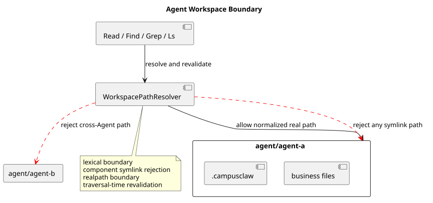

# CampusClaw 受管 Agent 工具系统 v2

> 文档版本：1.2.0
>
> 状态：Implemented
>
> 日期：2026-08-24
> 决策记录：[ADR-0022](../decisions/0022-managed-agent-tool-system-v2.html)

## 1. 结论与源码基线

CampusClaw 产品运行面只公开八个 PascalCase 内置工具：`Read`、`Find`、`Grep`、`Ls`、
`Cron`、`ListMateTools`、`CallMateTool`、`Agent`。Runtime、Cron 和 Child Agent 通过同一个
`AgentSessionFactory` 创建相同类型、相同工具 Pipeline 和相同 hook/error/cancellation 语义的
Session；各 Session 的消息、工作目录、工具实例、Mate 缓存和 Execution 上下文彼此隔离。

本实现以以下只读源码基线为设计证据：

| 仓库 | Commit | 用途 |
|---|---|---|
| CampusClaw merge base | `d649866a6cae967ace18ceaeb9597edd47e5721e` | PR 167 实现前行为基线 |
| CampusClaw PR 167 | `f60cc3e78bb8b700527ac082c7c8e10524ede095` | TUI/CLI 删除边界修订输入 |
| pi | `5cd93f688aaab89dbb6dfa4aca535f21796ae185` | Read、find、grep、ls 与工具调度对照 |
| OpenCode | `849c2598abc7d2b40261e74b5826bc74ffc78308` | Task/Child Agent 对照 |
| 设计仓 | `3fde5735cd27433c3e3e5e03a5ce39b297ad3b00` | 2.0.0 目标设计与本次修订输入 |

关键实现证据：

- `modules/agent-core/src/main/java/com/campusclaw/agent/tool/AgentTool.java`：`executionMode()`；
- `modules/agent-core/src/main/java/com/campusclaw/agent/tool/ToolExecutionPipeline.java`：Schema 校验、并行批次与串行 barrier；
- `modules/coding-agent-cli/src/main/java/com/campusclaw/codingagent/tool/builtin/BuiltInToolName.java`：关闭的八工具集合；
- `modules/coding-agent-cli/src/main/java/com/campusclaw/codingagent/session/AgentSessionFactory.java`：三入口公共 Session 装配；
- `modules/coding-agent-cli/src/main/java/com/campusclaw/codingagent/runtime/AgentRuntimeManager.java`：缓存优先 prepare、原子 refresh；
- `modules/coding-agent-cli/src/main/java/com/campusclaw/codingagent/tool/workspace/WorkspacePathResolver.java`：工作区和符号链接边界；
- `modules/coding-agent-cli/src/main/java/com/campusclaw/codingagent/tool/mate/MateToolSessionCache.java`：Session 缓存及 single-flight；
- `modules/coding-agent-cli/src/main/java/com/campusclaw/codingagent/tool/agent/SubagentExecutionService.java`：Child Execution；
- `modules/coding-agent-cli/src/main/java/com/campusclaw/codingagent/session/ManagedAgentSession.java`：公共压缩与最多一次溢出重试；
- `modules/coding-agent-cli/src/main/java/com/campusclaw/codingagent/command/SlashCommandRegistry.java`：未注册到 Host 的 Slash Command 核心；
- `modules/coding-agent-cli/src/main/java/com/campusclaw/codingagent/runtimeapi/session/RuntimeSessionModelReconciler.java`：refresh 后下一次执行的模型懒校准；
- `modules/cron/src/main/java/com/campusclaw/cron/tool/CronTool.java`、
  `modules/cron/src/main/java/com/campusclaw/cron/engine/CronJobExecutor.java`：Agent 隔离管理与触发执行。

## 2. 观察、实现和差异分类

| 主题 | 基线源码观察 | 本次实现 | 分类与原因 |
|---|---|---|---|
| 工具发现 | Spring ToolCatalog、Extension 与多个旧工具共同进入装配面 | 关闭枚举 + 严格 profile + 工厂装配 | 架构改造：模型契约必须可审计且不受 classpath 漂移影响 |
| 本地文件 | Read/Grep/Ls 可接收进程可见路径，Find 对应旧 Glob | 四工具统一限制到 `agent/{agentId}`，拒绝符号链接和 realpath 越界 | 安全加固：防止跨 Agent 读取 |
| Mate 调用 | List 接受 Agent/Skill ID；Call 依赖预先 List 的缓存 | List 只接受可选 `skillName`；Call 按名称，miss 自动完整发现 | 产品约束：模型不感知内部 ID 或调用来源 |
| Child | `spawn_agent`、`invoke_agent`、ACP/HTTP/A2A 与独立 runner 并存 | `Agent({agentName,task})` 只解析直接绑定，并通过公共 SessionFactory 执行 | 架构改造：统一父子执行语义并删除后端身份概念 |
| Cron | payload 固化 model/system/tools，并由旧本地 Session 执行 | Job 只保存 agentId/prompt，触发时 prepare 并使用 cron profile | 架构改造：配置随 Agent 当前绑定生效 |
| CLI | 服务入口可分发到 CLI/TUI，Loop 属于 CLI Session | 产品只保留服务入口；无 CLI profile、Loop 或 `/reload` | 产品约束：CampusClaw 是 ToB 服务 |
| Session 压缩 | 压缩、文件追踪和溢出恢复耦合在旧 TUI/CLI 大型 Session | 压缩迁入 `ManagedAgentSession`；阈值、溢出和一次重试对三入口一致 | 架构改造：入口删除不能连带删除公共上下文能力 |
| Slash Command | 处理器位于 CLI/TUI 编排树，依赖旧 Session 与终端输出 | 保留核心、Registry 和四个处理器，改用宿主无关端口；首版无 Host 注册 | 架构改造：保留可复用命令语义，不新增产品入口 |
| 写与命令 | Bash/Edit/Write 可作为模型工具 | 底层代码可保留，但不在枚举、配置、工厂或 Spring 工具发现链 | 安全加固：当前 Agent 只具备只读本地能力 |

## 3. 总体架构


[PlantUML 源码](tool-system-v2/diagram.puml#L1)

`AgentSessionFactory` 是 Runtime HTTP、Cron trigger 和 Child Execution 唯一公共装配点。
Host 决定持久化与生命周期；Session 只拥有 Agent、消息、工具实例、hook、取消域和 Session
级缓存。应用级 `ReadOperations`、`MateToolClient`、`CronService` 等依赖可以共享，但任何
`AgentTool` 实例均不得跨 Session 复用。

## 4. 关闭工具集合和入口配置

```yaml
campusclaw:
  tools:
    runtime: [Read, Find, Grep, Ls, Cron, ListMateTools, CallMateTool, Agent]
    cron: [Read, Find, Grep, Ls, ListMateTools, CallMateTool, Agent]
    child-agent: [Read, Find, Grep, Ls, ListMateTools, CallMateTool]
```

配置列表完全替换缺省值；显式空数组表示该入口没有工具。名称大小写敏感，未知名称、重复
名称以及旧名称均使启动失败。`ToolEntryPoint` 只有 `RUNTIME`、`CRON`、`CHILD_AGENT`。

| 工具 | Runtime | Cron | Child | 模式 |
|---|:---:|:---:|:---:|---|
| `Read` | ✓ | ✓ | ✓ | PARALLEL |
| `Find` | ✓ | ✓ | ✓ | PARALLEL |
| `Grep` | ✓ | ✓ | ✓ | PARALLEL |
| `Ls` | ✓ | ✓ | ✓ | PARALLEL |
| `Cron` | ✓ |  |  | SEQUENTIAL |
| `ListMateTools` | ✓ | ✓ | ✓ | PARALLEL |
| `CallMateTool` | ✓ | ✓ | ✓ | SEQUENTIAL |
| `Agent` | ✓ | ✓ |  | SEQUENTIAL |

同一模型响应中的相邻 PARALLEL 调用由虚拟线程并发执行；SEQUENTIAL 调用是前后批次的
barrier。结果始终按模型原始 tool-call 顺序写回，包括已知与未知工具混排。参数先通过
工具 JSON Schema 校验，再进入 before hook、执行、after hook 和事件投影；失败统一成为
`ToolResultMessage(isError=true)`。

## 5. Agent 工作区边界



[PlantUML 源码](tool-system-v2/diagram.puml#L38)

`Read`、`Find`、`Grep`、`Ls` 的根目录固定为 `agent/{agentId}`，而不是
`.campusclaw` 子目录。`WorkspacePathResolver` 对输入执行：

1. 规范化绝对/相对路径并做词法边界检查；
2. 从根到目标逐段拒绝符号链接；
3. 使用 `toRealPath()` 再次确认真实路径仍位于该 Agent 根；
4. 遍历发现的每个路径在读取/输出前再次复核。

四个工具不调用 Bash。Find 使用 glob，Grep 支持正则/字面量、glob 和上下文；两者应用
`.gitignore`。Read 对齐文本分块及图片读取，Ls 包含 dotfile、名称排序并给目录追加 `/`。

## 6. 受管目录 prepare 与 refresh

目录契约固定为：

```text
agent/{agentId}/.campusclaw/
├── agent.json
├── settings.json
├── SYSTEM.md
├── agents/{agentName}.json
└── skills/{skillName}/
    ├── skill.json
    ├── SKILL.md
    ├── references/
    └── templates/
```

`prepare(agentId)` 完整缓存命中时不访问 Mate；缓存缺失或不完整时在同级 staging 目录生成、
完整校验后原子发布。管理面 `refresh(agentId)` 总是重新拉取，失败时保留旧目录。目录中的
Agent/Skill 名称必须和文件路径精确一致且大小写折叠后唯一；任何 `tools.json` 或符号链接都
使缓存无效。HTTP Session 创建、Cron 触发和 Child 执行都会先 prepare；工具配置不热更新。

refresh 成功不修改正在执行的 Session 快照。空闲数据库 Session 在下一次接受用户 Entry 前读取
最新目录：当前模型仍有效时保持不变；失效时原子切换到具备凭据的新 default，并先持久化
`session.model.changed` 及必要的 `session.thinking.changed`。没有可用 default 时，本次请求在
写入 `user.message` 前失败。

## 7. Mate 实时发现与名称调用


[PlantUML 源码](tool-system-v2/diagram.puml#L66)

`ListMateTools({skillName?})` 无参数查询当前 Agent；有名称时通过已准备目录映射到 Skill ID。
每次都实时访问 Mate，输出稳定 JSON，仅含 `scope` 和各工具的 `name`、`description`、
`inputSchema`。内部客户端分为 `listAgentTools(agentId)` 和 `listSkillTools(skillId)`，按 ID
关联批量元数据并恢复 Mate 绑定顺序。

`CallMateTool({tool,args?})` 只按名称调用。缓存是 Session 私有的完整“名称 → ID”快照：

- 命中时只执行一次 Mate 工具；
- miss 时 single-flight 发现当前 Agent 和所有直接 Skill 的完整集合；
- 同名同 ID 合并，同名不同 ID 原子失败；
- 发现成功后替换完整快照，再解析名称；
- 自动流程只重试发现，绝不重放已发出的 execute。

并发 miss 共享同一轮成功或失败结果。List 只更新被查询来源的最近成功快照，不清空其他
来源。Mate 继续负责最终授权、参数校验和执行凭据验证。

## 8. Child Execution

`Agent({agentName,task})` 只接受 `.campusclaw/agents/{agentName}.json` 的精确直接绑定。
`SubagentExecutionService` 校验 enabled、固定版本、最大深度 1、祖先路径循环、Child 目录和
模型白名单，然后用 `AgentSessionFactory` 创建 `CHILD_AGENT` Session。Child 有可用 default
model 时优先使用，否则继承父模型和 thinking；两种情况都必须满足 Child bindingModels。

父取消传播给 Child，父侧只收到高层进度，成功结果只返回 Child 最后一条非空 Assistant
文本。首版深度为 1，因此 Child profile 不公开 `Agent`，版本不匹配也不会隐式 refresh。
父子是否部署在同一进程不属于工具契约。

## 9. Cron 边界

`Cron` 只由 Runtime Session 管理。模型不能提交 `agentId`、`model`、`system_prompt` 或
`tools`；创建时自动写入当前 Agent ID。list/delete/trigger/status/runs 均先校验 Job 所有者，
不同 Agent 对同一 Job ID 得到 not found。

`CronService` 作为 `SmartLifecycle` 随 Spring 服务启动和停止。触发时 `CronJobExecutor` 把
`agentId/prompt` 交给 `ManagedCronSessionRunner`，后者重新
prepare、解析当前 default model，并通过 `CRON` profile 创建公共 Session。当前 JSON Store
和进程内 scheduler 是遗留 Host 实现；集群租约、misfire 和持久化仍是独立 Cron Host 主题。

## 10. 公共 Session 压缩

`ManagedAgentSession` 对 Runtime、Cron 和 Child 提供相同的上下文压缩语义。默认配置为
`enabled=true`、`reserveTokens=16384`、`keepRecentTokens=20000`：

- 正常完成后超过阈值时压缩；上下文溢出时移除本次错误 Assistant，压缩后最多重试一次；
- 摘要调用失败时不替换 Agent 消息，数据库历史 Entry 也不删除；
- 成功时以完整摘要和最近消息替换模型上下文，`session.compaction.completed` 持久化摘要、
  保留边界、压缩前后 Token 和本次 Usage；
- `FileOperationTracker` 只从历史 `Read` ToolCall 收集文件，Bash/Edit/Write 不参与追踪；
- Runtime 投影瞬态 started/failed，completed 进入历史，父取消通过 Session close 传播。

## 11. TUI/CLI 能力边界

| 能力 | 处理 | 目标位置或原因 |
|---|---|---|
| TUI 组件、CLI launcher、Interactive/OneShot/RPC/ACP | 删除 | 产品入口退出 |
| JSONL Session、tree/navigation、本机 Auth、旧 SettingsManager | 删除 | Runtime 使用数据库和受管设置 |
| import/export/copy/share、剪贴板、外部编辑器、Prompt Template | 删除 | 终端交互专属 |
| PackageManager、Skill 本地安装/链接/导入、Extension、主题、快捷键 | 删除 | Skill 只来自受管目录 |
| Slash core、Registry、`/model`、`/thinking`、`/compact`、`/name` | 保留并解耦 | `command` 包只依赖宿主无关 Session/Output 端口 |
| 阈值/溢出压缩、Read 文件追踪 | 迁移 | 公共 `ManagedAgentSession` 与 `session.compaction` |

首版任何 Host 都不注册 Slash Command，不增加 HTTP Slash 或 Compact 接口，也不拦截
`POST /events` 中以 `/` 开头的普通消息。`/name` 的未来端口只能由 Host 适配 mate-service，
不得把 Chat 名称写入 Runtime Session。

## 12. 迁移和禁用清单

- 服务 `main` 不再分发 CLI；删除 CLI Spring profile 和 CLI 集成契约。
- `Bash`、`Edit`、`Write`、`Loop`、`Glob`、`activate_skill`、`spawn_agent`、`invoke_agent`、
  `EditDiff` 不属于活动工具集合。
- 动态 ToolCatalog/Extension、旧外部 SubAgent backend 不再由 Spring 自动发现。
- TUI 产品模块、动态 ToolCatalog/Extension、旧 Child backend 和旧工具入口源码已删除；
  Slash Command 核心及四个处理器保留，但未被 Spring 或 HTTP Host 注册；
  `Bash`、`Edit`、`Write` 的底层实现只作为未装配代码保留，且不是 Spring Bean。
- 本变更不提供旧名称别名、旧 Cron payload 或 CLI 兼容入口。

## 13. 验证

实现测试覆盖严格配置、每 Session 新工具实例、Schema-before-hook、hook 顺序、并行 barrier、
工作区越界/符号链接、原子 prepare/refresh 回滚、无 `tools.json`、Mate 稳定 JSON、缓存隔离、
single-flight 成功与失败、执行不重放、Child 直接绑定/版本/深度/循环/取消/进度、Cron Agent
隔离和 HTTP 冷目录创建。仓库交付前执行：

```text
./mvnw clean verify
./scripts/sync-mate-campusclaw.sh
git diff --check
```

## 14. 版本历史

| 版本 | 日期 | 说明 |
|---|---|---|
| 1.2.0 | 2026-08-24 | 修订 PR 167 删除边界：迁移公共压缩与 Read 追踪，保留未注册的 Slash 核心和四个处理器，增加 Usage/领域事件及 refresh 后懒校准 |
| 1.1.0 | 2026-08-24 | 完成 CLI/TUI 与旧装配源码清理；明确模型仅来自服务端目录和部署凭据、staging 与 `.campusclaw` 同属 Agent 工作区、Child default 不可用时回退父模型 |
| 1.0.0 | 2026-08-24 | 实现三入口、八工具、Agent 工作区隔离、Mate miss 自动发现、公共 SessionFactory、Child Execution 与 Runtime-only Cron |
