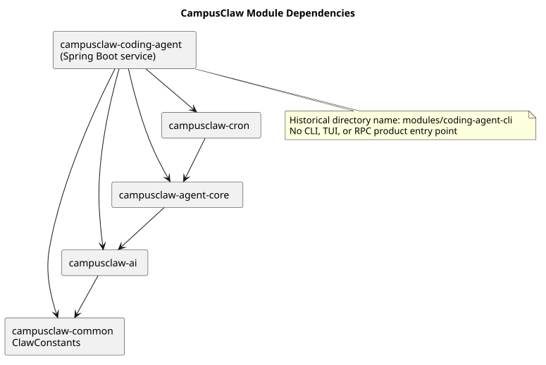

# CampusClaw 模块架构

> 文档版本：2.1.0
>
> 状态：Implemented
>
> 更新日期：2026-08-24
>
> 实现前源码基线：`d649866a6cae967ace18ceaeb9597edd47e5721e`
>
> PR 167 修订基线：`f60cc3e78bb8b700527ac082c7c8e10524ede095`

## 1. 结论

CampusClaw 是 JDK 21 + Spring Boot 3.4.1 的 ToB Agent Runtime 服务。Maven Reactor 只包含
`ai`、`agent-core`、`cron` 和 `coding-agent-cli` 四个 Java 模块；CLI/TUI 产品入口和
`modules/tui` 已删除。`coding-agent-cli` 只是历史目录名，当前职责是组装 Spring Boot HTTP
服务、受管 Agent Session 和八个内置工具。

上述收敛相对源码基线属于产品约束和架构改造，不表示 pi 具备相同服务结构。规范性工具契约见
[CampusClaw 受管 Agent 工具系统 v2](designs/tool-system-v2.md)。

## 2. 模块依赖

[PlantUML 源码](module-architecture/diagram.puml#L1)

依赖方向固定为：

- `ai` 无仓内模块依赖；
- `agent-core` 依赖 `ai`；
- `cron` 依赖 `agent-core`；
- `coding-agent-cli` 依赖 `ai`、`agent-core` 和 `cron`，生成最终服务 JAR。

## 3. 模块职责

### 3.1 ai (`campusclaw-ai`)

统一 LLM 类型、Provider 适配、模型注册、凭据解析和流式协议。

| 包 | 职责 |
|---|---|
| `com.campusclaw.ai.types` | Message、ContentBlock、Tool、Model、Provider 等领域类型 |
| `com.campusclaw.ai.provider` | Anthropic、OpenAI、Mistral 及兼容 Provider |
| `com.campusclaw.ai.stream` | 流式消息事件与终态聚合 |
| `com.campusclaw.ai.model` | 内置模型注册表 |
| `com.campusclaw.ai.env` | 部署环境凭据解析 |

服务侧 `ModelCatalogService` 只取 `ModelRegistry` 中当前部署凭据可用的模型，不加载用户级
认证文件或自定义 CLI settings。

### 3.2 agent-core (`campusclaw-agent-core`)

提供与 Host 无关的 Agent 执行内核。

| 包 | 职责 |
|---|---|
| `com.campusclaw.agent` | Agent 门面与执行生命周期 |
| `com.campusclaw.agent.loop` | LLM 与工具的多轮循环 |
| `com.campusclaw.agent.tool` | AgentTool、JSON Schema 校验、hook 和批量 barrier |
| `com.campusclaw.agent.event` | 执行与工具事件 |
| `com.campusclaw.agent.state` | 消息和运行状态 |
| `com.campusclaw.agent.queue` | Steer 与 FollowUp 队列 |
| `com.campusclaw.agent.context` | 消息转换和上下文变换 |

`agent-core` 不拥有具体工具，也不包含旧 ACP/HTTP/A2A Child backend。相邻 PARALLEL 工具
调用由虚拟线程并发执行，SEQUENTIAL 调用形成 barrier，结果仍按模型原始顺序返回。

### 3.3 cron (`campusclaw-cron`)

提供定时任务领域模型、当前进程 Host、运行日志和 Runtime-only `Cron` 工具。

| 包 | 职责 |
|---|---|
| `com.campusclaw.cron.model` | CronJob、CronSchedule、CronPayload 和状态 |
| `com.campusclaw.cron.engine` | 进程内调度和 Job 执行 |
| `com.campusclaw.cron.store` | 当前 JSON/JSONL Host 持久化 |
| `com.campusclaw.cron.tool` | Agent 隔离的 Cron 工具契约 |

Job 只保存当前 Agent ID 和 prompt；触发时由上层 `ManagedCronSessionRunner` 使用公共
`AgentSessionFactory` 创建 `CRON` Session。集群租约和数据库调度是后续独立 Host 主题。

### 3.4 coding-agent-cli (`campusclaw-coding-agent`)

Spring Boot 服务装配模块。目录名保留 `cli` 仅为避免当前构建坐标迁移，不代表产品入口。

| 包 | 职责 |
|---|---|
| `com.campusclaw.codingagent.runtimeapi` | Runtime HTTP、SSE、Session 持久化和执行 Host |
| `com.campusclaw.codingagent.session` | 三入口公共 AgentSessionFactory |
| `com.campusclaw.codingagent.session.compaction` | 公共上下文压缩与 Read 文件追踪 |
| `com.campusclaw.codingagent.command` | 未注册的宿主无关 Slash Command 核心与四个处理器 |
| `com.campusclaw.codingagent.runtime` | 受管目录 prepare/refresh 和 CampusMate 客户端 |
| `com.campusclaw.codingagent.tool.builtin` | 八工具关闭枚举、严格配置和装配器 |
| `com.campusclaw.codingagent.tool.ops` | 不调用 shell 的只读文件操作 |
| `com.campusclaw.codingagent.tool.mate` | Mate 实时发现、Session 缓存和名称调用 |
| `com.campusclaw.codingagent.tool.agent` | 直接绑定 Child Execution |
| `com.campusclaw.codingagent.tool.cron` | Agent scoped Cron 和触发 Session |
| `com.campusclaw.codingagent.skill` | Skill 目录解析和提示词格式化 |
| `com.campusclaw.codingagent.model` | 服务端可用模型目录 |

本模块不再包含 Picocli、TUI、RPC、终端 Session JSONL、Extension、动态 ToolCatalog 或用户级
认证设置链。Slash Command 核心不是产品入口：首版无 Host 注册，不增加 HTTP 路由，也不解析
普通用户消息。

## 4. 运行与持久化边界

- Spring MVC Host 管理 HTTP 请求、数据库 Session/Entry 和请求范围 SSE；
- 公共 Session 管理 Agent、工具实例、hook、取消域和 Session 级 Mate 缓存；
- `AgentRuntimeManager` 管理 `agent/{agentId}/.campusclaw` 的缓存优先 prepare 和管理面 refresh；
- Runtime、Cron 和 Child 使用同一 Session 类型，但各自消息、cwd、工具实例和上下文隔离；
- `mate-campusclaw` 由 `scripts/sync-mate-campusclaw.sh` 从四个主模块生成，不双份维护。

## 5. 源码证据

| 结论 | 仓库相对路径与符号 |
|---|---|
| 四模块 Reactor | `pom.xml` 的 `<modules>` |
| 服务唯一入口 | `modules/coding-agent-cli/src/main/java/com/campusclaw/codingagent/CampusClawApplication.java` |
| 公共 Session | `modules/coding-agent-cli/src/main/java/com/campusclaw/codingagent/session/AgentSessionFactory.java` |
| 关闭工具集合 | `modules/coding-agent-cli/src/main/java/com/campusclaw/codingagent/tool/builtin/BuiltInToolName.java` |
| 工具 Pipeline | `modules/agent-core/src/main/java/com/campusclaw/agent/tool/ToolExecutionPipeline.java` |
| Cron 执行端口 | `modules/cron/src/main/java/com/campusclaw/cron/engine/CronAgentSessionRunner.java` |

## 6. 版本历史

| 版本 | 日期 | 说明 |
|---|---|---|
| 2.1.0 | 2026-08-24 | 按职责修订 TUI 删除边界，保留未注册 Slash 核心并把压缩迁入公共 Session |
| 2.0.0 | 2026-08-24 | 收敛为四个 Java 模块和纯服务入口，删除 TUI/CLI 与动态扩展描述 |
| 1.x | 2026-08-24 以前 | 五模块终端 Agent 架构，已由工具系统 v2 取代 |
